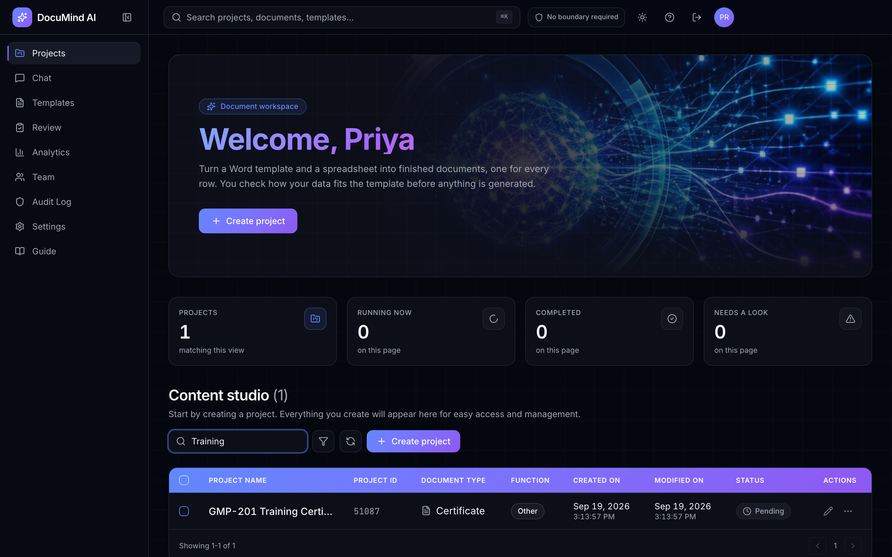
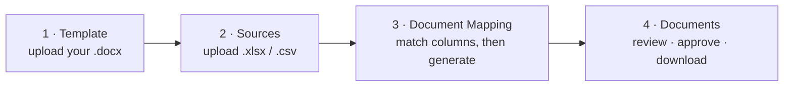
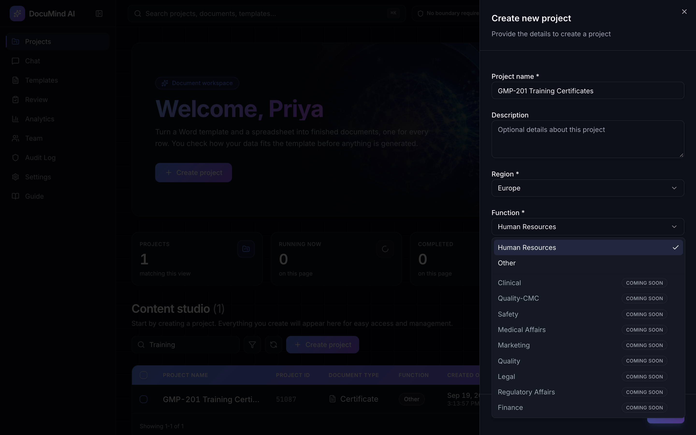
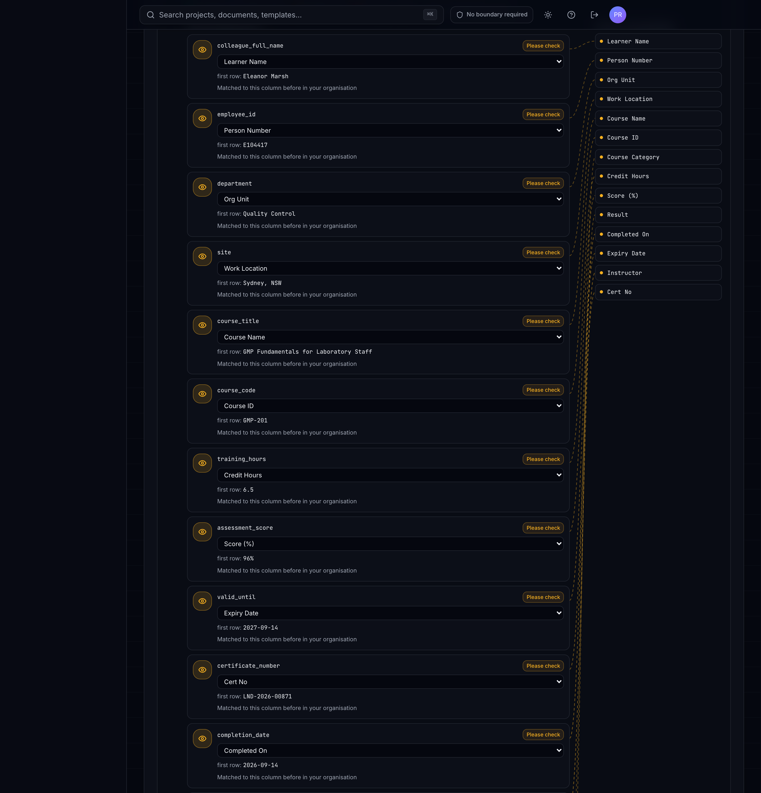
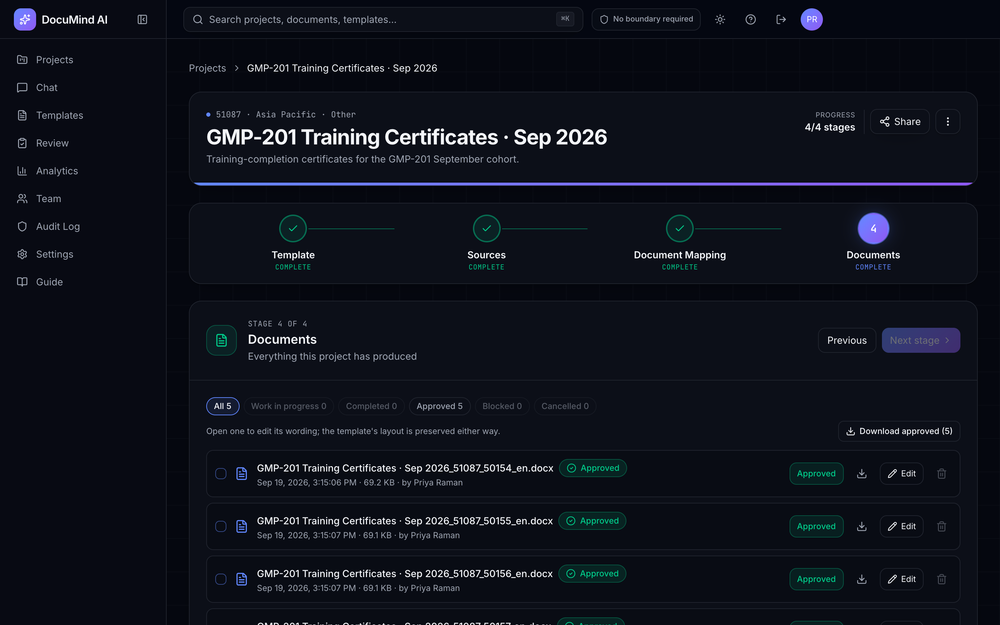
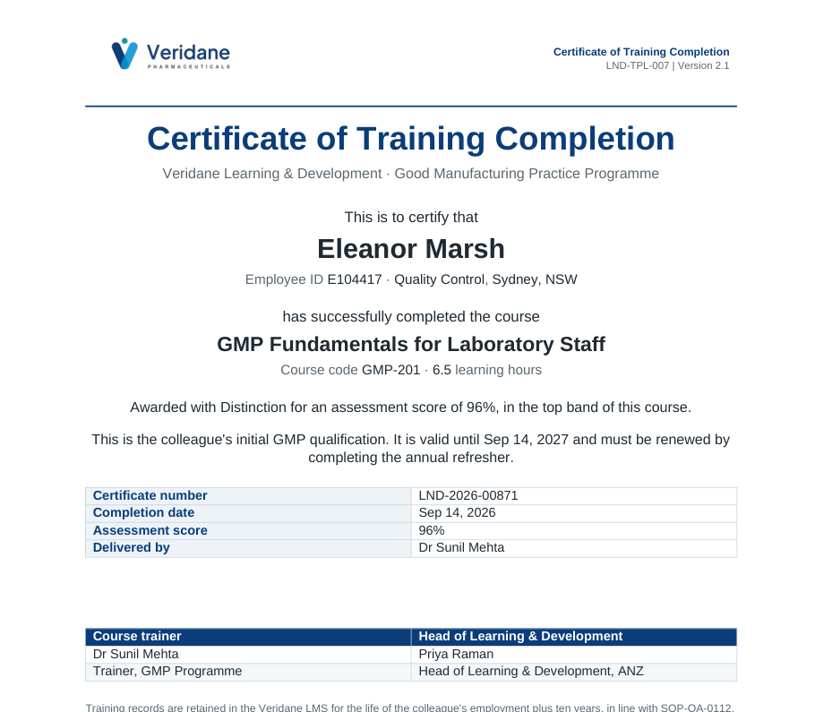

<div align="center">

# DocuMind AI

**Upload a Word template and a spreadsheet. Get back one finished, reviewed document for every row, laid out exactly like your original.**




</div>

---

## Contents

1. [What it does](#what-it-does)
2. [Functions available today](#functions-available-today)
3. [How it works](#how-it-works)
4. [Key features](#key-features)
5. [Screenshots](#screenshots)
6. [Getting started](#getting-started)
7. [Configuration](#configuration)
8. [Tests](#tests)
9. [Project structure](#project-structure)
10. [Documentation](#documentation)
11. [Contributing](#contributing)

---

## What it does

Teams in regulated industries fill in the same Word documents again and again. They copy values from a spreadsheet, delete the clauses that don't apply and remove the author's notes, one document at a time.

DocuMind AI does that work for you:

- You upload the **template you already use**. You don't need to rebuild or re-tag it.
- You upload the **spreadsheet you already have**, with one row per document.
- You get **one finished document per row**. Each keeps your letterhead, fonts, tables and legal wording and includes only the clauses that apply to that row.
- Every document is **reviewed and approved** before it can be downloaded, and every action is recorded in the audit log.

---

## Functions available today

| Function | Status | Document types |
|---|---|---|
| **Human Resources** | ✅ Available | Offer letters, termination letters, promotion memos, policy updates, other HR letters |
| **Other** | ✅ Available | Anything else: certificates, agreements, notices, forms, reports, general documents. It runs the same flow as HR. |
| Clinical, Quality-CMC, Safety, Medical Affairs, Marketing, Quality, Legal, Regulatory Affairs, Finance | 🕒 Coming soon | Shown in the project picker but not yet selectable |

The functions that are coming soon are hidden in one place, [`ACTIVE_FUNCTIONS`](src/lib/store.ts), and open up there when they're ready.

---

## How it works

Every project moves through four stages:



1. **Template.** Upload a Word file. DocuMind reads it and lists the values each document needs and the sections that depend on a choice. Reading can run in the background while you keep working.
2. **Sources.** Upload the spreadsheet, or download a ready-made one with the right columns already named.
3. **Document Mapping.** Pair each value with a spreadsheet column. Suggestions are made for you, and pairings your organisation has confirmed before are remembered. Then generate.
4. **Documents.** Read, comment, request changes, approve and download as DOCX or PDF, one at a time or as a ZIP.

---

## Key features

| | |
|---|---|
| **Layout preserved** | Each document is made from a copy of your own template. Nothing is rebuilt. |
| **Right clauses for each row** | Optional sections are kept or removed for each row based on its data. |
| **Values come from your data** | Every name, date and figure comes from a cell. A document missing a required value is held back rather than sent with a gap. |
| **Checked before the batch** | A few documents are made first as a check. If one fails, the batch stops. |
| **Review workflow** | Comments, change requests and approvals, and authors can't close a review of their own document. |
| **Approved before download** | Unapproved documents can't be downloaded by any route. |
| **Audit trail** | Uploads, approvals and downloads are recorded with who did them and when. |
| **Multi-tenant** | Each organisation's data is isolated from every other organisation's. |
| **Local formats** | Dates, currency and numbers are formatted for the project's locale. |
| **Template library** | Reuse, delete (one at a time or several at once) and archive templates. |

---

## Screenshots

| Choose a function | Map columns |
|---|---|
|  |  |

| Documents ready for approval | A finished document |
|---|---|
|  |  |

For the full walkthrough, see **[docs/DEMO_README.md](docs/DEMO_README.md)**. The demo data belongs to the fictional company *Veridane*.

---

## Getting started

### Prerequisites

- **Bun**, for the frontend
- **Docker** (recommended), or Python 3.12, PostgreSQL 17 with pgvector, and Redis on the host

### Option A: Docker Compose

```sh
docker compose up -d db redis        # PostgreSQL 17 + pgvector, Redis
docker compose run --rm migrate      # database migrations
docker compose up api                # API on http://localhost:8000
```

Nothing is seeded on start, so create your organisation and first user:

```sh
docker compose exec api python -m app.bootstrap \
  --org "Your Organisation" --email you@example.com \
  --name "Your Name" --password 'choose-a-long-one'

# Add a reviewer too. An author can't close a review of their own document.
docker compose exec api python -m app.bootstrap add-user \
  --org "Your Organisation" --email colleague@example.com \
  --name "Their Name" --role approver --password '...'
```

Then start the frontend from the repo root:

```sh
bun install
bun run dev                          # http://localhost:8080
```

### Option B: on the host

```sh
cd backend
python3.12 -m venv .venv && source .venv/bin/activate
pip install -r requirements.txt
cp .env.example .env                 # then fill it in (see Configuration)
alembic upgrade head
python -m app.bootstrap --org "..." --email ... --name "..." --password '...'
uvicorn app.main:app --reload --port 8000
```

Run the backend commands from `backend/`, because the settings file and the migrations are resolved relative to it. For the PostgreSQL roles the app expects, see [docs/ARCHITECTURE.md](docs/ARCHITECTURE.md#13-getting-started).

`GET /readyz` reports whether the database and Redis are reachable.

---

## Configuration

| Where | Variable | Purpose |
|---|---|---|
| Frontend | `VITE_API_URL` | API base URL (default `http://localhost:8000/api/v1`) |
| Backend | `ENV` | `development` or `production`. Production refuses unsafe defaults. |
| Backend | `DATABASE_URL` | PostgreSQL in anything but local development |
| Backend | `REDIS_URL` | Redis connection |
| Backend | `JWT_SECRET` | Signing secret. The default is refused in production. |
| Backend | `CORS_ORIGINS` | JSON list, e.g. `["http://localhost:8080"]` |
| Backend | AI provider settings | Provider name and key. See `backend/.env.example`. |

Never commit `.env` files or keys.

---

## Tests

```sh
cd backend && ./scripts/check.sh     # the full gate. CI runs this same script.
npx tsc --noEmit -p .                # frontend type check
```

- The gate runs fully offline and enforces coverage floors. The last full run gave **3,328 passed and 2 skipped**.
- CI runs the suite on both SQLite and PostgreSQL, because some constraints only exist on PostgreSQL.
- Some tests need customer-owned template files that aren't in this repository. Those tests are skipped on a fresh checkout.

---

## Project structure

```
TemplateAI/
├── src/                     # Frontend: React 19, TanStack Router, Tailwind, shadcn/Radix
│   ├── routes/              #   pages (public + signed-in app)
│   ├── components/          #   UI components
│   └── lib/                 #   API client, state store, types
├── backend/
│   ├── app/                 # FastAPI application
│   │   ├── routers/         #   HTTP endpoints
│   │   ├── hr/              #   HR function (starter kit)
│   │   ├── templates/       #   template handling
│   │   ├── generation/      #   document production and export
│   │   └── ...              #   auth, tenancy, audit, retention, analytics
│   ├── alembic/             # database migrations
│   ├── tests/               # test suite
│   └── scripts/check.sh     # test gate used by CI
├── docs/                    # guides, specs and screenshots
└── docker-compose.yml
```

---

## Documentation

| Document | For | What's in it |
|---|---|---|
| [docs/HR_README.md](docs/HR_README.md) | Users | Step-by-step guide to the HR function (and **Other**) |
| [docs/DEMO_README.md](docs/DEMO_README.md) | Prospects and demos | Illustrated product walkthrough |
| In-app **Guide** | Signed-in users | Template authoring guide |
| [docs/BACKLOG.md](docs/BACKLOG.md) | Engineers (internal) | Prioritised unfinished work (A–D) |
| [docs/ARCHITECTURE.md](docs/ARCHITECTURE.md) | Engineers (internal) | Detailed engineering overview |
| [APPLICATION_FLOW.md](APPLICATION_FLOW.md) | Engineers (internal) | Data model, flows and routes |
| [docs/BACKEND_SPEC.md](docs/BACKEND_SPEC.md) | Engineers (internal) | Backend specification |
| [AGENTS.md](AGENTS.md) | Contributors | Lovable sync notes |

---

## Contributing

- Branch from `main` and open a pull request. **Don't force-push or rebase pushed history**, because this repo syncs with the Lovable editor.
- Run `backend/scripts/check.sh` and `npx tsc --noEmit -p .` before pushing.
- Keep customer documents and data out of the repository.

---

<sub>© 2026 DocuMind AI. All rights reserved. Proprietary and confidential.</sub>
