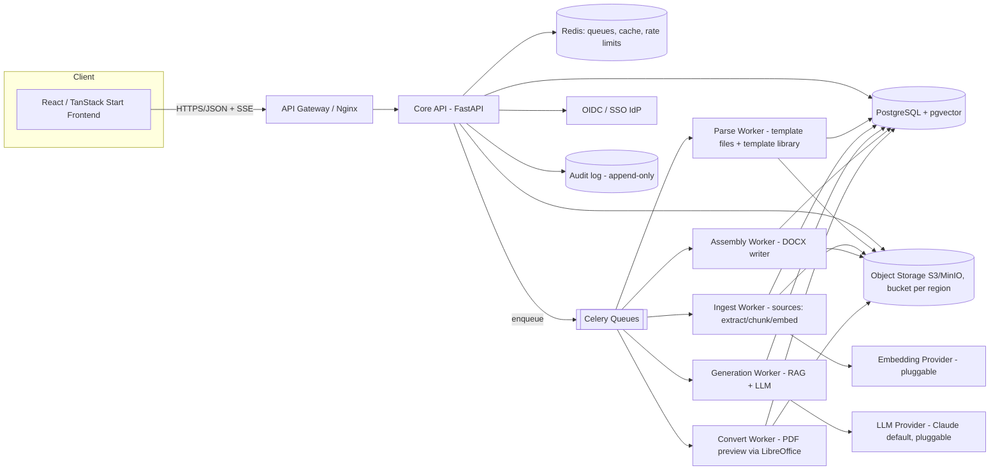
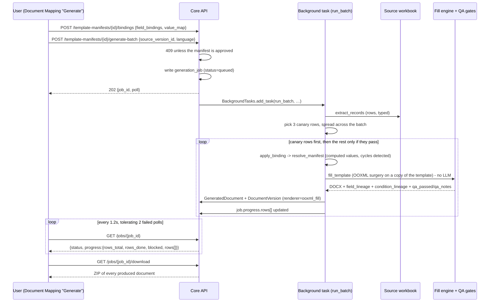
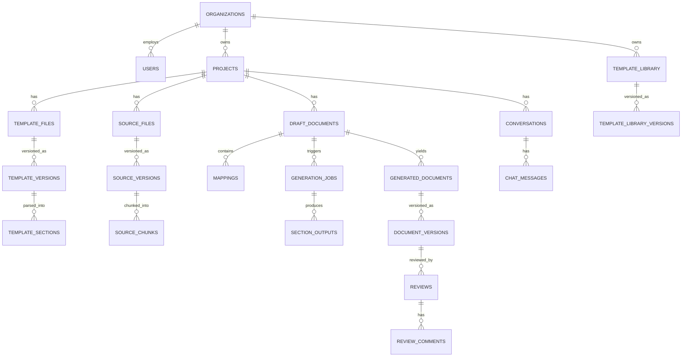
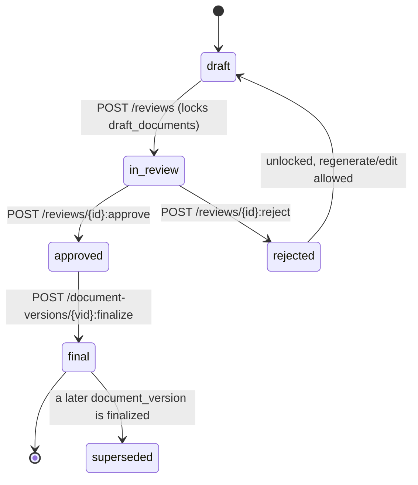

# DocuMind AI — Backend Engineering Specification

   

**One-line tagline:** *The backend that turns a Word template, a pile of source files, and a mapping into an audited, on-brand, regenerated document — grounded, versioned, and reviewable.*

**Status:** specification for a backend that does not exist yet, written against an **existing, fully-built frontend** (`docucraft-ai`, private repo `pythometa1/docucraft-ai`, product name "DocuMind AI"). Every entity, enum, filename convention, and workflow step below was reverse-engineered from that frontend's source — routes, Zustand store, and components — so the API this document defines is not aspirational: it is exactly what `src/routes/**` and `src/lib/store.ts` already expect to call. Section 25 is the direct traceability table from frontend file → backend endpoint.

**How to use this doc:** place at `docs/BACKEND_SPEC.md` (done), implement milestone by milestone (§24). Each milestone unblocks specific frontend screens, so progress is externally verifiable by pointing the existing UI at the new API and watching demo/local state replace itself with real data.

### Implementation status (updated as of this build)

`backend/` is a real, running implementation, wired end-to-end to the frontend — not a mock. What's actually true today, vs. still the aspirational target described below:

> **Read this before §2, §6.5, §6.6, §10–§13 and §24–§25.** The product was re-architected around the **Template Compiler + Universal Fill Engine**, and the "draft + mapping wizard" pipeline this spec was originally written against has been **deleted from both backend and frontend**. There is no draft entity in the flow, there are **zero `/drafts/…` endpoints**, and the 3-step mapping wizard screen no longer exists. §2 and §6.5 below have been corrected. **Later sections still use the draft/mapping vocabulary in places** (§10.9, §11.4, §13, §15.7, §17.2/§17.4, §23, §24, §25) — read those as the historical design intent they always were, and substitute *manifest* for *draft* and *binding* for *mapping* when mapping them onto the code. §20's package layout was never adopted; the real tree is `app/{routers,templates,compiler,manifests,expressions,retrieval,generation,qa,llm,audit}` — see `APPLICATION_FLOW.md` §3 for the file-by-file map.

| Area | Built | Spec's longer-term target (not yet done) |
|---|---|---|
| Database | **Real PostgreSQL 17 + pgvector**, Alembic-migrated (`backend/alembic/`, 14 revisions). SQLite is dev/test only — it cannot express RLS, the `vector` type, or a session timezone, and `ENV=production` refuses to start on a non-Postgres URL | Read replicas, partitioning (§15.4) |
| Multi-tenancy | **Row-level security is live** (§14.2): a policy on every `org_id` table keyed on the `app.current_org` session GUC (`app/tenancy.py`, migration `e5b26f0d71a4`), and the app connects as `documind_app` — created **NOSUPERUSER NOBYPASSRLS** by `backend/scripts/init-db/01-app-role.sh`, with migrations run by a separate owner role. Per-handler `owned_*` checks sit on top | — |
| Cache / rate limiting | **Real Redis** — token-bucket rate limiting (§15.5), logout/session revocation, and short-lived download grants are live, not simulated | Full multi-level cache (§15.3), analytics rollup materialized view (§19.4) |
| Auth | JWT + bcrypt, Redis-backed revocation. A real `/login` screen; no demo credentials anywhere | OIDC/SSO (§14.1). RBAC is **partial**: `app/authz.py` enforces separation of duties on manifest approval, `MANAGE_USERS` and `READ_AUDIT`; most endpoints still require only authentication |
| Async jobs | **Batch generation is asynchronous** — `POST /template-manifests/{id}/generate-batch` returns `202` and runs on FastAPI `BackgroundTasks`, with the client polling `GET /jobs/{id}`. Compile and single-record fill still run in-request | Celery/queue-based with retries, cancellation and restart survival (§15.2, §17) |
| Retrieval | **Hybrid, in the §10.5 order**: tenant filter → lexical (TF-IDF/keyword) → pgvector similarity → merge/rerank → top-k only to the compiler (`app/retrieval/hybrid.py`). Plus per-org **mapping memory** with acceptance *and* rejection counts | Learned reranker; managed embedding provider |
| LLM | Real Anthropic / Gemini / OpenAI behind one `LLMProvider` interface, with structured-output schemas. **No offline stub** — a missing key yields `503 LLM_NOT_CONFIGURED` rather than invented text. `LLM_COMPILE_PROVIDER` can send compiling to a different vendor from generating. Residency and zero-retention are enforced at the boundary before a prompt exists (§14.6) | Multi-provider failover, circuit breakers (§17.3) |
| Template understanding | Heading + jinja kinds (§7.2), native token templates (§8), **and the colour/bracket/MERGEFIELD manifest path**, which is the one in use | `content_control`/SDT parsing |
| Review | **A real human-in-the-loop queue** (`/review`, `review_tasks`): calculations needing sign-off, ambiguous conditions, weak bindings, poorly-grounded narrative. Manifest approval has its own validation endpoint and warning-acknowledgement record | §13's section-anchored comments, e-signature, notifications |
| Deletion & retention | `DELETE /projects/{id}` (soft, cascading the stamp), `DELETE /documents/{id}` (hard, blob cascade, `409` on an approved document), `DELETE /sources/{id}` and `DELETE /templates/{id}`; per-org data policy, retention sweep, tenant offboarding and deletion certificates | Customer-configurable per-artefact schedules beyond the current set |
| Testing | 47 test modules under `backend/tests/`, including golden-DOCX fixtures per template family, RLS tests, LLM-boundary/residency tests and a production-config guard | The full §23 pyramid (k6 load, contract tests) |
| **Template Compiler + Universal Fill Engine** (`docs/TEMPLATE_COMPILER_RESEARCH.md`) | **Fully implemented, and now fully driven from the UI.** Colour-run classification, rule-based *and* LLM compilers with an agentic compile→fill→read-QA→revise loop, plain-English rendering of conditions for approvers, a deterministic fill engine, QA gates, batch generation with a canary gate, template families and manifest inheritance. See `app/templates/parsers/`, `app/compiler/`, `app/manifests/`, `app/expressions/`, `app/generation/`, `app/qa/`, and `app/routers/{manifests,bindings}.py`. The reviewer UI is `src/components/document-mapping.tsx` and `src/routes/_app.projects.$id_.studio.$templateId.tsx` | Bulk onboarding, clustering, manifest inheritance and manifest diff are built but still API-only — no screen calls them |
| ~~Drafts, mappings, section-mapping RAG generation~~ | **Removed.** `POST /drafts/{id}/generate`, `POST /drafts/{id}/mappings`, `GET /drafts/{id}/mapping-suggestions`, `GET /drafts/{id}/coverage`, `GET /drafts/{id}/documents` and the wizard screen are all gone | — |

See `README.md` at the repo root for how to actually run it, and `APPLICATION_FLOW.md` for what the code does today end to end.

---

## Table of Contents

1. [Overview & Goals](#1-overview--goals)
2. [End-to-End Workflow (frontend-mapped)](#2-end-to-end-workflow-frontend-mapped)
3. [System Architecture](#3-system-architecture)
4. [Technology Stack](#4-technology-stack)
5. [Data Model](#5-data-model)
6. [REST API Reference](#6-rest-api-reference)
7. [Template Understanding I — Imported DOCX Templates](#7-template-understanding-i--imported-docx-templates)
8. [Template Understanding II — Native Token Templates](#8-template-understanding-ii--native-token-templates)
9. [Source Ingestion Pipeline](#9-source-ingestion-pipeline)
10. [Generation Engine (RAG + LLM Orchestration)](#10-generation-engine-rag--llm-orchestration)
11. [Document Assembly](#11-document-assembly)
12. [Document Versioning](#12-document-versioning)
13. [Review & Approval Workflow](#13-review--approval-workflow)
14. [Security, RBAC, Multi-Tenancy & Compliance](#14-security-rbac-multi-tenancy--compliance)
15. [Scalability & Performance](#15-scalability--performance)
16. [Data Structures & Algorithms Reference](#16-data-structures--algorithms-reference)
17. [Reliability & Fault Tolerance](#17-reliability--fault-tolerance)
18. [Observability & LLM Telemetry](#18-observability--llm-telemetry)
19. [Configuration & Environments](#19-configuration--environments)
20. [Project Structure](#20-project-structure)
21. [Getting Started](#21-getting-started)
22. [Deployment & CI/CD](#22-deployment--cicd)
23. [Testing Strategy](#23-testing-strategy)
24. [Implementation Roadmap (Milestones)](#24-implementation-roadmap-milestones)
25. [Frontend ↔ Backend Endpoint Map](#25-frontend--backend-endpoint-map)
26. [Assumptions, Open Questions, Contributing & License](#26-assumptions-open-questions-contributing--license)

---

## 1. Overview & Goals

### 1.1 What we are building

A web platform where enterprise users generate formatted documents (HR letters, CMC sections, quality documents, medical-affairs content) by combining:

1. **A template** — either an uploaded DOCX blueprint (structure/order/layout/styling, §7) or a template authored natively in DocuMind's own token editor (§8, mirrors `src/components/template-editor.tsx`).
2. **One or more source files** — DOCX/PDF/XLSX/PPTX/TXT/CSV with the raw content and data.
3. **Mappings** — user-defined links: "fill template section/token X using source file(s) Y with action Z."
4. **The generation engine** — retrieves grounded context per section/token and writes content that the assembler injects back into a copy of the template, preserving exact layout.

This replaces a manual copy-paste process while keeping a human in the loop: draft → review → approve → final.

### 1.2 Key features

**AI capabilities**
- Grounded generation with per-block citations back to source chunks (no un-sourced claims in regulated document types).
- Two complementary template models: section-mapping over imported DOCX (§7) and inline color-coded tokens over natively-authored templates (§8) — both resolve through one generation engine (§10).
- Hybrid retrieval (vector + BM25 + rerank) over chunked, embedded source content; multilingual embeddings for `en`/`de`/etc. output.
- AI-suggested section↔source mappings, ranked by title-embedding similarity, replacing the frontend's placeholder positional "Auto-map with AI" button with a real similarity search.
- Grounded chat over a project's documents (`/chat` in the frontend).

**Platform features**
- Multi-tenant, region-aware storage (data residency), RBAC with per-project role overrides, immutable audit log, versioned documents with redline diff and rollback, section-anchored review/approval with e-signature capture.
- Usage ledger for tokens/cost per org/project/day, feeding the Analytics and Billing screens directly.

**Developer experience**
- One data model serves the entire frontend as-is — no client rewrite required, only swapping Zustand calls for `fetch`/SSE calls.
- Idempotent, resumable async jobs with SSE progress that the frontend's existing toast/SSE-shaped UI (job status strings, per-section progress) was already designed around.
- Provider-pluggable LLM/embeddings behind two interfaces (`LLMProvider`, `EmbeddingProvider`) so the "AI Models" settings tab (GPT-4 Turbo / Claude 3.5 Sonnet / Gemini 1.5 Pro / Llama 3.1 70B) is a real, switchable registry, not static markup.

### 1.3 Non-goals (v1)

- Real-time co-editing (Google-Docs style) — versioned check-in/check-out instead (§12).
- In-browser template *design* — DOCX templates are authored in Word; native token templates are authored in DocuMind's own editor, both are already-built frontend surfaces we're serving, not redesigning.
- Output formats beyond DOCX + PDF preview/export. XLSX/PPTX generation is a v2 candidate.

### 1.4 Glossary

| Term | Meaning |
|---|---|
| **Project** | Workspace unit holding templates, sources, drafts, generated documents. Has region, function, document type. Matches `src/lib/types.ts: Project`. |
| **Template file** | Project-scoped uploaded DOCX defining output structure (`Step1Template` in `_app.projects.$id.tsx`). Parsed into a section tree (§7). |
| **Template library entry** | Org-wide, reusable, token-based template authored in DocuMind's editor (`_app.templates.tsx`). Distinct entity from "template file" — see §8. |
| **Template section** | A node in a template file's parsed tree (heading span, content control, or jinja variable) that can be mapped and filled. |
| **Token** | An inline unit inside a native template's content: `static`, `source`, `prompt`, `conditional`, `repeat` (§8.1) — exactly the five colors in `TOKEN_COLORS` in `template-editor.tsx`. |
| **Source file** | Uploaded data/content file (`Step2Source`). Parsed → elements → chunks → embeddings (§9). |
| **Chunk** | A retrievable unit of source text with metadata + embedding vector. |
| **Draft document** | Named container inside a project owning a set of mappings; produces generated document versions (`Step4Drafts`). |
| **Mapping** | *Historical.* Was (template file, selected sections, action, source files, instructions, params) — the unit of generation intent in the removed wizard. The word now means a **binding**: which source column feeds which manifest field. |
| **Manifest** | The compiled, machine-executable translation of a template's own embedded rules — fields, conditions, blocks, `delete_always`. Immutable once approved; the unit of generation intent today. |
| **Binding** | `(manifest, source version) → {field_id: column}` plus a `value_map` reconciling vocabulary ("FT" → "Full time"). |
| **Band** | `AUTO_ACCEPT` / `CONFIRM` / `REVIEW` / `BLOCK` — how much evidence a suggested binding has, and therefore how much human attention it needs (§13). |
| **Canary** | Rows rendered and QA-checked before the rest of a batch is allowed to run. |
| **Action** | *Historical.* Was what to do for mapped sections: `ai_generate` \| `ai_summarize` \| `extract_table` \| `copy_verbatim` \| `rewrite` \| `translate` \| `manual`, driven by the UI labels Replace / Append / Insert at position / AI Transform. The wizard that offered those labels is gone; a manifest carries **unit kinds** (`field`, `calculation`, `condition`, `narrative`) instead, and a `narrative` unit routes to the review queue rather than to an unattended model. |
| **Review task** | A unit the engine would not guess — a calculation needing sign-off, an ambiguous condition, a weak binding, poorly-grounded narrative — parked with enough context for a human to decide, and resumable without recomputing what was already settled. |
| **Renderer** | Which code produced a document version (`ooxml_fill` / `docx_template_assembly` / `html_assembly`), recorded on the row; it is what decides whether an HTML save would be lossless (§12). |
| **Generation job** | A generation run — today, a batch fill of one manifest against one source version, `202`-accepted and polled. |
| **Generated document / version** | Immutable output artifact, filename `{project.name}_{project.display_id}_{doc.display_id}_{lang}.docx` — exactly the pattern in `store.ts`'s `addGenerated` and the mapping page's `save()`. |
| **Fact sheet** | Auto-extracted structured key facts (names, dates, IDs, amounts) reused across sections/tokens for cross-section consistency. |

---

## 2. End-to-End Workflow (frontend-mapped)

Every subsection below cites the exact frontend file it serves, so there is no ambiguity about what the backend must return.

### 2.1 Content studio (`src/routes/_app.dashboard.tsx`)

Table of projects: name, `projectId` (numeric display id, e.g. `51255`), document type, function, created/modified timestamps, status pill (`Completed`/`In Progress`/`Pending`/`Failed` — exactly `StatusBadge`'s four states, **not** the `draft|in_progress|completed|archived` set from an earlier draft of this schema — reconciled in §5.2), row actions. Client-side search today (`p.name`/`p.projectId`/`p.documentType`/`p.function` substring match) — backend must support the same via `?q=`.

### 2.2 Create project (`src/components/create-project-sheet.tsx`)

Fields: name*, description, region* (`REGIONS` — Europe/North America/Asia Pacific/Latin America/Middle East & Africa/Global), function* (`FUNCTIONS`, 9 values), document type* (cascades from function via `DOCUMENT_TYPES[fn]`), language, plus an "Advanced" drawer (approval workflow toggle, audit trail toggle — currently decorative, becomes `projects.generation_settings.require_review` and is always-on for audit). On submit: create, toast, navigate to `/projects/$id`.

### 2.3 Project detail — 4-stage pipeline (`src/routes/_app.projects.$id.tsx`)

> **Changed.** This was a **5-stage** rail — Template, Sources, **Method**, **Drafts**, Generated. It is now four, and the third stage is the whole workflow rather than a hand-off to a separate screen. The `STAGES` array in `_app.projects.$id.tsx` is the authoritative list.

`done[stage]` is computed **client-side** off array lengths; `GET /projects/{id}` returns the same booleans pre-computed:

| Stage | Frontend key | Frontend "done" condition | Backend field |
|---|---|---|---|
| 1 · Template | `template` | `project.templates.length > 0` | `has_templates` |
| 2 · Sources | `source` | `project.sources.length > 0` | `has_sources` |
| 3 · Document Mapping | `mapping2` | `project.generated.length > 0` | `has_generated_documents` |
| 4 · Documents | `drafts` | `project.generated.length > 0` | `has_generated_documents` |

The stage **keys** are leftovers and no longer mean what they say: `mapping2` is Document Mapping and `drafts` is the Documents stage. Stages 3 and 4 share a predicate deliberately — Document Mapping counts as done once it has produced something, which is the same fact that fills the Documents stage.

`has_generation_method` and `has_drafts` are still returned by the API and are no longer read by any screen: the Method stage was removed (it never changed generation behaviour) and there is no draft entity.

- **Stage 1 (Template):** upload dialog accepts `.docx, .dotx`; each upload becomes a `template_files` row → §7. Each row carries an **"Open in Studio"** link to `/projects/$id/studio/$templateId` and a delete action (`DELETE /templates/{id}`).
- **Stage 2 (Sources):** accepts `.csv, .xlsx, .pdf, .docx, .txt`; each upload becomes a `source_files` row → §9, and its column descriptions are indexed into the vector store. Delete cascades to embeddings and manifest bindings.
- **Stage 3 (Document Mapping):** §2.4 below.
- **Stage 4 (Documents):** lists `GET /projects/{id}/documents`; each row has download / edit / delete. There is deliberately no "regenerate" — a document record keeps no manifest, source version or row index.

### 2.4 Document Mapping (`src/components/document-mapping.tsx`)

> **Replaces the mapping wizard.** The 3-step wizard at `src/routes/_app.projects.$id.mapping.$draftId.tsx` — Template → Action → Source, with a live preview panel and a Save that fired `POST /drafts/{id}/mappings` followed by `POST /drafts/{id}/generate` — has been **deleted**, along with every endpoint it called. It had no manifest, so it filled nothing: a template of `<placeholders>` came back out of it unchanged. What follows is what exists instead.

Rendered inline in stage 3, not on its own route. A template picker, a source picker and — for `.xlsx` — a sheet picker sit above four steps. The current step is **derived**, never stored: `!manifest ? 1 : manifest.status !== "approved" ? 2 : !job ? 3 : 4`. Changing the (template, source, sheet) triple resets every derived value, because posting the previous spreadsheet's column names against a new `source_version_id` would write whatever sits under those headers into every letter.

1. **Compile the template** — `GET /templates/{id}/manifests` first, to pick up an existing manifest rather than paying for a fresh compile. Otherwise `POST /templates/{id}/compile-manifest`, or the same with `?agentic=true` ("Compile & self-verify": compile → test-fill real rows → read the QA failures → revise). The compiler prompt is given retrieval evidence drawn from this org's indexed **source column** descriptions only — feeding back previously-compiled manifest fields would close a loop and converge the estate on its own first guess.
2. **Review and approve** — conditions are shown in **plain English** ("Keep when …"), rendered server-side from the same AST the evaluator runs and returned on manifest GETs as `plain_english` / `approval_sentence`; a condition that cannot be rendered is displayed as broken rather than omitted. `GET /template-manifests/{id}/validation` supplies `can_approve`, `failures[]`, `warnings[]` and `warning_dispositions` so the blockers are visible *while deciding*, not as a 409 afterwards. A warning is cleared by acknowledging it (`POST …/warnings:resolve` with a note recorded under the acknowledger's name) — a judgement, not a dismissal. Then `POST /template-manifests/{id}:approve`; approved manifests are immutable and subject to separation of duties.
3. **Map fields to columns** — `GET /template-manifests/{id}/binding-suggestions?source_version_id=&sheet=` returns ranked candidates per field with a `method`, a `confidence`, a `rationale`, a `sample_value` and a **band** (`AUTO_ACCEPT` / `CONFIRM` / `REVIEW` / `BLOCK`), plus `unmatched_fields`, `unused_columns` and `unmatched_condition_values` — source values that select *no* branch of the template, each of which is a letter that would generate with a conditional section silently missing. Reconciling those is the `value_map` half of the binding. Saved with `POST /template-manifests/{id}/bindings`.
4. **Generate documents** — `POST /template-manifests/{id}/generate-batch` → `202 {job_id, status, poll}`, run on a background task. Three **canary** rows, spread evenly across the batch rather than taken from the front, render and are QA-checked before the rest is attempted. The client polls `GET /jobs/{id}` every 1.2 s, tolerating two failed polls before stopping *and saying so* with a "Check again" button. On completion, `GET /jobs/{id}/download` returns every document as one ZIP.

**Template Studio** (`src/routes/_app.projects.$id_.studio.$templateId.tsx`) is the same four steps — Compile → Review → Bind → Generate — as a full-screen, per-template surface, and adds `GET /template-manifests/{id}/preview` (the template as the compiler saw it) and `POST /template-manifests/{id}/preview-row`.

### 2.5 Document editor (`src/routes/_app.projects.$id_.edit.$docId.tsx`)

> **No longer the main path.** This screen used to be where a generated draft was finished by hand. Manifest-filled documents are complete when they are generated; the editor is now for the HTML-assembled ones and for reading.

TipTap (StarterKit + Underline + Placeholder) over the generated document's current HTML. Toolbar: undo/redo, paragraph/H1–H3, bold/italic/underline/strike, bullet/ordered list, blockquote, code block, divider. Header shows **Unsaved changes** / **All changes saved** / **Approved**, with **Save**, **Approve**, **Revoke approval** and a download.

Two guards that did not exist when this section was first written:

- `GET /document-versions/{vid}` returns **`html_editable`**, decided server-side from the version's `renderer`. Only `html_assembly` output can be rebuilt from HTML losslessly; `ooxml_fill` and `docx_template_assembly` cannot, and `NULL` fails closed. `PATCH` refuses those with `409 DOCUMENT_NOT_HTML_EDITABLE`. The old guard asked whether the row *had* HTML — true of template-filled documents too, since the legacy path stored an HTML preview beside them — so it never fired on the one path it existed to protect.
- There is **no placeholder document**. The editor used to fall back to a `DEFAULT_HTML` sample whenever `html_content` was empty, which is exactly the case for every manifest-path document — so opening a real generated letter showed invented content that looked like output, and one Save rebuilt the `.docx` from it.

### 2.5b Review queue (`src/routes/_app.review.tsx`)

Separate from document approval, and new since this spec was written. The queue of units the engine would not guess — `calculation`, `condition`, `binding`, `narrative` — with `GET /review-tasks`, `/review-tasks/summary`, `POST /review-tasks/{id}:resolve` (the decision can be promoted back into the manifest) and `:dismiss`. A manifest unit of kind `narrative` lands here rather than being written by an unattended model.

### 2.6 Template library (`src/routes/_app.templates.tsx` + `template-editor.tsx`)

Distinct, **org-wide** entity from a project's template files (§1.4). Left rail: searchable, category-filterable (`HR/Clinical/Quality-CMC/Medical Affairs/Marketing/Legal`) list with starred/version/uses badges. Right pane: the token editor — toolbar with formatting controls **plus four token-insert buttons** (Source `{ }`, Prompt `⚡`, Conditional `⌥`, Repeat `↻`), a color legend, and a right-side **Inspector** that edits the selected token's attributes. "New template" and "Convert legacy template" (wizard, §2.7) both land here.

### 2.7 Legacy template conversion wizard (`src/components/template-conversion-wizard.tsx`)

Four steps — **Upload → Detect → Review → Save**. This still runs **entirely client-side**: `mammoth.extractRawText()` for `.docx`, then a regex heuristic (`detectCandidates`) tuned by a document-family preset (Offer letter/HR, Legal contract, Clinical report, Medical affairs, Auto-detect), user reviews/edits each candidate, then `applyCandidates()` produces tokenized HTML saved via `POST /template-library`. The backend's job is **parity + persistence**, not replacing this UX (§8.4) — and `POST /template-library:convert`, the parity endpoint, is still not called by any screen.

### 2.8 Chat (`src/routes/_app.chat.tsx`)

Conversation list + message thread. **No longer canned** — the page calls `GET/POST /projects/{id}/conversations` and `GET/POST /conversations/{id}/messages`, and the replies are real conversations grounded in project source chunks (k=6) via the §10 retrieval path. Responses are returned whole; SSE streaming remains a target, not a fact.

### 2.9 Analytics, Team, Audit Log, Settings

**No longer constant arrays.** `_app.analytics.tsx` calls all four of `GET /analytics/{kpis,trend,by-function,top-templates}`; `_app.team.tsx` calls `GET /team/members` and `GET /team/roles-summary`; `_app.audit-log.tsx` calls `GET /audit-logs`. Settings reads `GET /me`; nothing else on that page persists yet, and the remaining tabs in the §25 table (organisations, model profiles, notification preferences, sessions, API keys, billing) have no endpoints.

---

## 3. System Architecture



### 3.1 Architecture style: modular monolith, not microservices or pure event-driven

**Chosen:** one FastAPI app with bounded modules (`app/projects`, `app/templates`, `app/sources`, `app/generation`, `app/review`, `app/admin`) plus Celery workers in the same repo, sharing the ORM models. **Why:** the domain is a single linear pipeline per project (template → sources → mapping → generation → review) with one team building it — microservice boundaries would be drawn along guesses, not real scaling pressure, and would add network hops and deployment surface for zero benefit at the stated scale. Heavy work is already isolated into async workers, which is where the real scaling need is (LLM calls, OCR, DOCX writing are slow, not the CRUD around them).

**Rejected: microservices per domain (templates-service, generation-service, review-service).** Trade-off: better team-scaling and independent deploys, but at this project's actual load (single-digit-thousands of orgs, not hyperscale) it multiplies operational cost (N deploy pipelines, N health checks, distributed transactions across `mappings`→`generation_jobs`→`document_versions` which today is one DB transaction) for a scaling problem we don't have yet. Revisit only if a specific module's write volume (e.g. generation jobs) needs to scale its *database* independently of the rest — at that point it peels off as its own service with its own Postgres, not before.

**Rejected: fully event-driven (every state change as a Kafka event, services react asynchronously).** Trade-off: excellent decoupling and audit-by-construction, but this domain has a small number of long-running async operations (parse, ingest, generate, assemble, convert) that already fit a job-queue model cleanly; going fully event-driven would mean rebuilding straightforward request/response flows (e.g. "list my projects") as event choreography for no user-facing benefit, and would complicate exactly the audit trail we need to keep dead simple (§14.7 uses one relational `INSERT`, not an event-sourced projection). We do use an internal event bus (Celery task signals + webhooks, §25) for the five genuinely async jobs — that is event-driven *where it earns its keep*, not everywhere.

### 3.2 Component breakdown

| Component | Responsibility | Technology | How it scales |
|---|---|---|---|
| API (Core) | Auth, CRUD, validation, job enqueue, SSE fan-out | FastAPI (async), Uvicorn/Gunicorn | Stateless — horizontal pod autoscaling behind the LB (§15.1) |
| Parse Worker | DOCX structural parsing (§7), native-template token parsing (§8) | Celery + `python-docx`/`lxml` | Scale by queue depth (`parse` queue) |
| Ingest Worker | Extraction, chunking, embedding (§9) | Celery + PyMuPDF/pdfplumber/openpyxl/python-pptx + embedding provider | Scale by queue depth (`ingest` queue); embedding calls batched |
| Generation Worker | Retrieval + LLM orchestration (§10) | Celery + `LLMProvider` | Scale by queue depth (`generate` queue); bounded per-job section concurrency |
| Assembly Worker | Layout-preserving DOCX writing (§11) | Celery + `python-docx`/raw OOXML | Scale by queue depth (`assemble` queue) |
| Convert Worker | DOCX→PDF preview, redline export | Celery + LibreOffice headless | Scale by queue depth (`convert` queue); CPU-bound, own node pool |
| Postgres | System of record: relational + vector (pgvector) + full-text | PostgreSQL 16 | Read replicas for analytics/reporting; partition hot tables (§15.4) |
| Redis | Queue broker, cache, rate-limit counters, SSE pub/sub | Redis 7 | Cluster mode at scale; cache and broker on separate instances |
| Object Storage | All binaries (uploads, generated versions, previews) | S3 / MinIO, bucket per region | Scales natively; lifecycle rules for retention (§14.6) |

### 3.3 Request lifecycle — one "Generate" click

> **Updated.** The wizard-driven lifecycle this section originally described — `POST /drafts/{id}/generate`, one LLM call per mapped section, SSE progress, a separate assembly worker — describes a path that no longer exists. What follows is the target shape *and* what is built: the batch is `202`-accepted and runs on an in-process background task, progress is polled rather than streamed, and **no LLM call happens at generation time at all**.



An LLM does appear in this product — for grounded chat, for `prompt` tokens in native templates, and once per template *family* at compile time — but never in the loop above. That is the whole thesis of `docs/TEMPLATE_COMPILER_RESEARCH.md`: use the model as a compiler, then run the compiled program deterministically forever.

---

## 4. Technology Stack

| Layer | Choice | Why / rejected alternative |
|---|---|---|
| Language/Framework | Python 3.12 + FastAPI | Best DOCX/PDF + LLM-orchestration ecosystem. *Rejected:* NestJS — would need a Python sidecar for docx work anyway, so no net win. |
| ORM / migrations | SQLAlchemy 2.x (async) + Alembic | Mature, async-native, explicit migrations. *Rejected:* Prisma-for-Python-style tools — smaller ecosystem for our OOXML/vector needs. |
| Database | PostgreSQL 17 + pgvector | One store for relational + vector + full-text (`tsvector`) — avoids a second system to keep consistent with the source of truth. *Rejected at v1:* a dedicated vector DB (Qdrant/Pinecone) — right call once vectors exceed ~20M rows or need independent scaling (§15.4 notes the swap point). |
| Queue | Celery + Redis (queues: `parse`, `ingest`, `generate`, `assemble`, `convert`) | Simple, battle-tested, matches our five bounded async job types. *Rejected:* Temporal — better workflow durability, real upgrade path once retry/compensation logic across multi-step jobs gets complex (flagged in §17). |
| Object storage | S3 / Azure Blob / MinIO (self-host) | Bucket per region for data residency (§14.6). |
| DOCX read | `python-docx`, raw `lxml` on `document.xml` | Need element indices, SDTs, `sectPr` that `python-docx` alone doesn't expose (§7.1). |
| DOCX write | `python-docx` + raw OOXML manipulation; `docxtpl` (Jinja2) for jinja-kind templates | Never Markdown→docx for final output — loses exact style fidelity (§11). |
| PDF extract | `PyMuPDF (fitz)` + `pdfplumber` (tables) + `ocrmypdf`/Tesseract fallback | Layout-aware text + tables + OCR for scans. |
| XLSX/CSV | `openpyxl`, `pandas` | Sheets → markdown tables / records. |
| PPTX | `python-pptx` | Slide text extraction. |
| LLM | Anthropic Claude API (default) behind `LLMProvider` interface | Long context, strong structured-output + tool-use behavior for the JSON block contract (§10.6); provider registry also supports Azure OpenAI / OpenAI / watsonx / local Ollama, matching the Settings → AI Models tab exactly. |
| Embeddings | Pluggable `EmbeddingProvider`: Voyage AI / OpenAI `text-embedding-3-large` / self-hosted `bge-m3` | Multilingual — required for the frontend's per-language output filenames. |
| Reranker (recommended) | Cohere Rerank or `bge-reranker-v2-m3` (self-host) | Large precision lift on retrieval before the LLM call (§10.5). |
| Auth | OIDC (Keycloak/Azure AD/Okta) + JWT | Enterprise SSO, matches "SSO (Okta)" toggle already in the Settings → Security tab. |
| DOCX→PDF | LibreOffice headless (`convert` worker) | In-browser preview, redline export. |
| AV scanning | ClamAV on every upload | §14.5. |
| Observability | OpenTelemetry + Prometheus/Grafana + structured JSON logs; Langfuse for LLM traces | §18. |
| Deploy | Docker Compose (dev) → Kubernetes + Helm (prod) | Workers autoscale on queue depth (§15.1). |

---

## 5. Data Model

Conventions: every table has `id UUID PK DEFAULT gen_random_uuid()`, `created_at/updated_at timestamptz`, `created_by/updated_by UUID`; tenant tables carry `org_id UUID NOT NULL`; soft delete via `deleted_at timestamptz NULL`; human-friendly numeric IDs (project `51255`, generated doc `50615`) via per-org sequences exposed as `display_id` — this is exactly the number shown in the frontend's `projectId` field and the generated filename.

### 5.1 Entity relationships



### 5.2 Corrections against the frontend (read this before implementing)

| Field | Frontend reality | Schema decision |
|---|---|---|
| `projects.status` | Exactly 4 values rendered by `StatusBadge`: `Completed`, `In Progress`, `Pending`, `Failed` | `CHECK (status IN ('pending','in_progress','completed','failed','archived'))`, default `'pending'`. `archived` is a soft-hide state reachable only via the explicit archive action, never shown as a pipeline status. |
| `DOCUMENT_TYPES` | Keyed *by function* (`DOCUMENT_TYPES["Human Resources"] = [...]`) | `lookup_values` gets a `parent_value TEXT NULL` column; document-type rows set `parent_value = <function value>` so `GET /lookups?kind=document_type&parent=Human+Resources` reproduces the cascading `Select` exactly. |
| Template *library* vs template *file* | Two different screens, two different entities (org-wide reusable tokens vs. project-scoped DOCX blueprint) | New `template_library` / `template_library_versions` tables (§8), kept separate from `template_files` / `template_versions` (§7). A project's Step 1 may *optionally* seed from a library entry, but they remain distinct rows. |
| `audit_logs` severity tint | `_app.audit-log.tsx` colors rows `info/success/warning/danger` | Add `severity TEXT NOT NULL DEFAULT 'info' CHECK (severity IN ('info','success','warning','danger'))` column rather than deriving it ad hoc from `event` string at read time — needed for filtering, not just display. |
| Generated filename | `` `${project.name}_${project.projectId}_${random5digit}_en.docx` `` (mapping page) and store seed `` `${name}_${projectId}_50615_en.docx` `` | Canonical format fixed as `` `{project.name}_{project.display_id}_{generated_documents.display_id}_{language}.docx` ``; `generated_documents.display_id` uses its own per-org sequence starting at `50000`. |
| Chat | Static conversations/messages array | New `conversations` / `chat_messages` tables, project-scoped, generation-engine-backed (§10.7). |

### 5.3 Core DDL

```sql
-- ============ tenancy & identity ============
CREATE TABLE organizations (
  id UUID PRIMARY KEY DEFAULT gen_random_uuid(),
  name TEXT NOT NULL,
  region_default TEXT NOT NULL DEFAULT 'europe',
  settings JSONB NOT NULL DEFAULT '{}',        -- quotas, allowed models, retention days, public workspace flag
  created_at timestamptz NOT NULL DEFAULT now(),
  updated_at timestamptz NOT NULL DEFAULT now()
);

CREATE TABLE users (
  id UUID PRIMARY KEY DEFAULT gen_random_uuid(),
  org_id UUID NOT NULL REFERENCES organizations(id),
  email CITEXT NOT NULL UNIQUE,
  full_name TEXT NOT NULL,
  job_title TEXT, timezone TEXT DEFAULT 'UTC',           -- Settings > Profile tab
  idp_subject TEXT UNIQUE,
  status TEXT NOT NULL DEFAULT 'active',                 -- active|disabled|invited (Team page)
  last_login_at timestamptz,
  created_at timestamptz NOT NULL DEFAULT now(),
  updated_at timestamptz NOT NULL DEFAULT now()
);

CREATE TABLE roles (                -- seeded: org_admin, admin, editor, viewer (Team page role tiles)
  id UUID PRIMARY KEY DEFAULT gen_random_uuid(),
  key TEXT NOT NULL UNIQUE,
  name TEXT NOT NULL,
  permissions JSONB NOT NULL         -- ["project:create","template:upload","review:approve",...]
);

CREATE TABLE org_memberships (
  user_id UUID REFERENCES users(id),
  org_id  UUID REFERENCES organizations(id),
  role_id UUID REFERENCES roles(id),
  function TEXT,                     -- Team page "Function" column (Clinical, Quality-CMC, ...)
  PRIMARY KEY (user_id, org_id)
);

-- ============ lookups (tenant-configurable dropdowns) ============
CREATE TABLE lookup_values (
  id UUID PRIMARY KEY DEFAULT gen_random_uuid(),
  org_id UUID NOT NULL,
  kind TEXT NOT NULL,                -- 'function' | 'document_type' | 'region' | 'language'
  value TEXT NOT NULL,
  parent_value TEXT,                 -- document_type rows point at their function
  sort_order INT NOT NULL DEFAULT 0,
  is_active BOOL NOT NULL DEFAULT true,
  UNIQUE (org_id, kind, value, parent_value)
);

-- ============ projects ============
CREATE SEQUENCE project_display_id_seq START 51000;
CREATE TABLE projects (
  id UUID PRIMARY KEY DEFAULT gen_random_uuid(),
  org_id UUID NOT NULL,
  display_id BIGINT NOT NULL DEFAULT nextval('project_display_id_seq'),
  name TEXT NOT NULL,
  description TEXT,
  region TEXT NOT NULL,
  function TEXT NOT NULL,
  document_type TEXT NOT NULL,
  language TEXT NOT NULL DEFAULT 'English',
  status TEXT NOT NULL DEFAULT 'pending'
    CHECK (status IN ('pending','in_progress','completed','failed','archived')),
  generation_settings JSONB NOT NULL DEFAULT '{}',  -- {method, model_profile, temperature, require_review}
  created_by UUID NOT NULL, updated_by UUID,
  created_at timestamptz NOT NULL DEFAULT now(),
  updated_at timestamptz NOT NULL DEFAULT now(),
  deleted_at timestamptz
);
CREATE INDEX ON projects (org_id, status, updated_at DESC);
CREATE INDEX ON projects (org_id, display_id);

CREATE TABLE project_members (
  project_id UUID REFERENCES projects(id),
  user_id UUID REFERENCES users(id),
  role_id UUID REFERENCES roles(id),
  PRIMARY KEY (project_id, user_id)
);

-- ============ physical storage ============
CREATE TABLE blobs (
  id UUID PRIMARY KEY DEFAULT gen_random_uuid(),
  org_id UUID NOT NULL,
  bucket TEXT NOT NULL, object_key TEXT NOT NULL,
  size_bytes BIGINT NOT NULL,
  sha256 CHAR(64) NOT NULL,
  content_type TEXT NOT NULL,
  av_status TEXT NOT NULL DEFAULT 'pending',   -- pending|clean|infected
  created_at timestamptz NOT NULL DEFAULT now(),
  UNIQUE (org_id, sha256)
);

-- ---- Template FILES: project-scoped, imported DOCX blueprint (§7) ----
CREATE TABLE template_files (
  id UUID PRIMARY KEY DEFAULT gen_random_uuid(),
  org_id UUID NOT NULL, project_id UUID NOT NULL REFERENCES projects(id),
  name TEXT NOT NULL,
  current_version_id UUID,
  status TEXT NOT NULL DEFAULT 'uploaded',      -- uploaded|parsing|ready|failed|disabled
  parse_error TEXT,
  created_by UUID NOT NULL,
  created_at timestamptz NOT NULL DEFAULT now(),
  updated_at timestamptz NOT NULL DEFAULT now(),
  deleted_at timestamptz
);

CREATE TABLE template_versions (
  id UUID PRIMARY KEY DEFAULT gen_random_uuid(),
  template_file_id UUID NOT NULL REFERENCES template_files(id),
  version_no INT NOT NULL,
  blob_id UUID NOT NULL REFERENCES blobs(id),
  section_count INT,
  template_kind TEXT NOT NULL DEFAULT 'heading',  -- heading|content_control|jinja|mixed (§7.2)
  notes TEXT,
  created_by UUID NOT NULL,
  created_at timestamptz NOT NULL DEFAULT now(),
  UNIQUE (template_file_id, version_no)
);

CREATE TABLE template_sections (
  id UUID PRIMARY KEY DEFAULT gen_random_uuid(),
  template_version_id UUID NOT NULL REFERENCES template_versions(id) ON DELETE CASCADE,
  parent_id UUID REFERENCES template_sections(id),
  order_index INT NOT NULL,
  level INT NOT NULL,
  title TEXT NOT NULL,
  section_path TEXT NOT NULL,
  anchor JSONB NOT NULL,          -- {type:'heading_range'|'sdt'|'jinja_var', start_el, end_el, sdt_id, var}
  fingerprint CHAR(64) NOT NULL,
  example_text TEXT,
  fillable BOOL NOT NULL DEFAULT true,
  title_embedding vector(1024)
);
CREATE INDEX ON template_sections (template_version_id, order_index);

-- ---- Template LIBRARY: org-wide, native token-based templates (§8) ----
CREATE TABLE template_library (
  id UUID PRIMARY KEY DEFAULT gen_random_uuid(),
  org_id UUID NOT NULL,
  name TEXT NOT NULL,
  category TEXT NOT NULL,          -- HR|Clinical|Quality-CMC|Medical Affairs|Marketing|Legal|Finance|Other
  description TEXT,
  starred BOOL NOT NULL DEFAULT false,
  uses INT NOT NULL DEFAULT 0,
  current_version_id UUID,
  created_by UUID NOT NULL,
  created_at timestamptz NOT NULL DEFAULT now(),
  updated_at timestamptz NOT NULL DEFAULT now(),
  deleted_at timestamptz
);
CREATE INDEX ON template_library (org_id, category);

CREATE TABLE template_library_versions (
  id UUID PRIMARY KEY DEFAULT gen_random_uuid(),
  template_library_id UUID NOT NULL REFERENCES template_library(id),
  version_no INT NOT NULL,           -- surfaced to UI as 'v4.2' style string via app layer
  content_html TEXT NOT NULL,        -- TipTap-serialized HTML with <span data-token="..."> tokens (§8.1)
  source_fields TEXT[] NOT NULL DEFAULT '{}',  -- distinct `field` attrs referenced, for the Inspector's dropdown
  created_by UUID NOT NULL,
  created_at timestamptz NOT NULL DEFAULT now(),
  UNIQUE (template_library_id, version_no)
);

-- ---- Source files (project-scoped) ----
CREATE TABLE source_files (
  id UUID PRIMARY KEY DEFAULT gen_random_uuid(),
  org_id UUID NOT NULL, project_id UUID NOT NULL REFERENCES projects(id),
  name TEXT NOT NULL,
  file_type TEXT NOT NULL,             -- docx|pdf|xlsx|csv|pptx|txt|html
  current_version_id UUID,
  status TEXT NOT NULL DEFAULT 'uploaded', -- uploaded|parsing|chunking|embedding|ready|failed
  ingest_error TEXT,
  page_count INT, chunk_count INT,
  created_by UUID NOT NULL,
  created_at timestamptz NOT NULL DEFAULT now(),
  updated_at timestamptz NOT NULL DEFAULT now(),
  deleted_at timestamptz
);

CREATE TABLE source_versions (
  id UUID PRIMARY KEY DEFAULT gen_random_uuid(),
  source_file_id UUID NOT NULL REFERENCES source_files(id),
  version_no INT NOT NULL,
  blob_id UUID NOT NULL REFERENCES blobs(id),
  extraction_meta JSONB NOT NULL DEFAULT '{}',
  created_by UUID NOT NULL,
  created_at timestamptz NOT NULL DEFAULT now(),
  UNIQUE (source_file_id, version_no)
);

CREATE TABLE source_chunks (
  id UUID PRIMARY KEY DEFAULT gen_random_uuid(),
  org_id UUID NOT NULL, project_id UUID NOT NULL,
  source_version_id UUID NOT NULL REFERENCES source_versions(id) ON DELETE CASCADE,
  chunk_index INT NOT NULL,
  parent_chunk_id UUID REFERENCES source_chunks(id),
  element_type TEXT NOT NULL,           -- paragraph|table|list|title|figure_caption|sheet_rows
  heading_path TEXT,
  page_from INT, page_to INT,
  text TEXT NOT NULL,
  token_count INT NOT NULL,
  content_sha256 CHAR(64) NOT NULL,
  embedding vector(1024),
  tsv tsvector GENERATED ALWAYS AS (to_tsvector('simple', text)) STORED,
  metadata JSONB NOT NULL DEFAULT '{}'
);
CREATE INDEX ON source_chunks USING hnsw (embedding vector_cosine_ops);
CREATE INDEX ON source_chunks USING gin (tsv);
CREATE INDEX ON source_chunks (project_id, source_version_id, chunk_index);

-- ============ drafts, mappings, generation ============
CREATE TABLE draft_documents (
  id UUID PRIMARY KEY DEFAULT gen_random_uuid(),
  org_id UUID NOT NULL, project_id UUID NOT NULL REFERENCES projects(id),
  name TEXT NOT NULL, description TEXT,
  template_version_id UUID REFERENCES template_versions(id),
  status TEXT NOT NULL DEFAULT 'draft',   -- draft|generating|generated|in_review|approved|final
  lock_owner UUID, lock_expires_at timestamptz,
  created_by UUID NOT NULL,
  created_at timestamptz NOT NULL DEFAULT now(),
  updated_at timestamptz NOT NULL DEFAULT now(),
  deleted_at timestamptz
);

CREATE TABLE mappings (
  id UUID PRIMARY KEY DEFAULT gen_random_uuid(),
  org_id UUID NOT NULL, draft_id UUID NOT NULL REFERENCES draft_documents(id) ON DELETE CASCADE,
  template_version_id UUID NOT NULL REFERENCES template_versions(id),
  section_ids UUID[] NOT NULL,
  ui_action TEXT NOT NULL,              -- 'replace'|'append'|'insert'|'ai_transform' (verbatim UI labels)
  action TEXT NOT NULL,                 -- resolved engine action, see §6.5 mapping table
  instructions TEXT,
  params JSONB NOT NULL DEFAULT '{}',
  source_version_ids UUID[] NOT NULL DEFAULT '{}',
  field_mappings JSONB NOT NULL DEFAULT '{}',   -- {"{employee_name}":"full_name", ...} jinja-kind
  source_scope JSONB NOT NULL DEFAULT '{}',
  processing_order INT NOT NULL DEFAULT 0,
  created_by UUID NOT NULL,
  created_at timestamptz NOT NULL DEFAULT now(),
  updated_at timestamptz NOT NULL DEFAULT now()
);
CREATE UNIQUE INDEX uq_mapping_section ON mappings USING gin (draft_id, section_ids);
-- enforced additionally in the service layer: 409 SECTION_ALREADY_MAPPED on overlap.

CREATE TABLE generation_jobs (
  id UUID PRIMARY KEY DEFAULT gen_random_uuid(),
  org_id UUID NOT NULL, project_id UUID NOT NULL,
  draft_id UUID,                        -- null when generating from a template_library entry directly
  template_library_version_id UUID,     -- set for native token-template generation (§10)
  idempotency_key TEXT UNIQUE,
  status TEXT NOT NULL DEFAULT 'queued',  -- queued|running|assembling|completed|completed_with_errors|failed|cancelled
  progress JSONB NOT NULL DEFAULT '{}',
  model_profile TEXT NOT NULL,
  prompt_bundle_version TEXT NOT NULL,
  languages TEXT[] NOT NULL DEFAULT '{en}',
  error TEXT,
  token_usage JSONB NOT NULL DEFAULT '{}',
  started_at timestamptz, finished_at timestamptz,
  created_by UUID NOT NULL,
  created_at timestamptz NOT NULL DEFAULT now()
);

CREATE TABLE section_outputs (
  id UUID PRIMARY KEY DEFAULT gen_random_uuid(),
  job_id UUID NOT NULL REFERENCES generation_jobs(id) ON DELETE CASCADE,
  mapping_id UUID,                      -- null for token-based units
  token_id TEXT,                        -- TipTap node id, when generating from a native template
  section_id UUID,
  unit_kind TEXT NOT NULL DEFAULT 'section',  -- 'section' | 'token'
  language TEXT NOT NULL,
  status TEXT NOT NULL,                 -- pending|running|done|failed|skipped
  blocks JSONB,
  citations JSONB,
  grounding_score REAL,
  model TEXT, input_tokens INT, output_tokens INT, latency_ms INT,
  error TEXT,
  attempt INT NOT NULL DEFAULT 1,
  created_at timestamptz NOT NULL DEFAULT now()
);

CREATE SEQUENCE generated_doc_display_id_seq START 50000;
CREATE TABLE generated_documents (
  id UUID PRIMARY KEY DEFAULT gen_random_uuid(),
  org_id UUID NOT NULL, project_id UUID NOT NULL, draft_id UUID,
  display_id BIGINT NOT NULL DEFAULT nextval('generated_doc_display_id_seq'),
  language TEXT NOT NULL DEFAULT 'en',
  current_version_id UUID,
  status TEXT NOT NULL DEFAULT 'draft',   -- draft|in_review|approved|final|superseded
  created_at timestamptz NOT NULL DEFAULT now(),
  updated_at timestamptz NOT NULL DEFAULT now()
);

CREATE TABLE document_versions (
  id UUID PRIMARY KEY DEFAULT gen_random_uuid(),
  document_id UUID NOT NULL REFERENCES generated_documents(id),
  version_no INT NOT NULL,
  blob_id UUID NOT NULL REFERENCES blobs(id),
  pdf_preview_blob_id UUID,
  source_job_id UUID REFERENCES generation_jobs(id),
  html_content TEXT,                     -- editable HTML surfaced to the TipTap draft editor
  change_summary TEXT,
  section_snapshot JSONB,
  status TEXT NOT NULL DEFAULT 'draft',  -- draft|in_review|approved|final|rejected
  approved_by UUID, approved_at timestamptz,
  created_by UUID NOT NULL,
  created_at timestamptz NOT NULL DEFAULT now(),
  UNIQUE (document_id, version_no)
);

-- ============ review & audit ============
CREATE TABLE reviews (
  id UUID PRIMARY KEY DEFAULT gen_random_uuid(),
  org_id UUID NOT NULL,
  document_version_id UUID NOT NULL REFERENCES document_versions(id),
  status TEXT NOT NULL DEFAULT 'open',    -- open|approved|rejected|cancelled
  assignee_ids UUID[] NOT NULL,
  due_at timestamptz,
  decided_by UUID, decided_at timestamptz, decision_note TEXT,
  esign JSONB,
  created_by UUID NOT NULL,
  created_at timestamptz NOT NULL DEFAULT now()
);

CREATE TABLE review_comments (
  id UUID PRIMARY KEY DEFAULT gen_random_uuid(),
  review_id UUID NOT NULL REFERENCES reviews(id) ON DELETE CASCADE,
  section_id UUID,
  author_id UUID NOT NULL,
  body TEXT NOT NULL,
  resolved BOOL NOT NULL DEFAULT false,
  created_at timestamptz NOT NULL DEFAULT now()
);

CREATE TABLE audit_logs (
  id BIGINT GENERATED ALWAYS AS IDENTITY PRIMARY KEY,
  org_id UUID NOT NULL,
  actor_id UUID, actor_ip INET, actor_ua TEXT,
  event TEXT NOT NULL,
  severity TEXT NOT NULL DEFAULT 'info' CHECK (severity IN ('info','success','warning','danger')),
  entity_type TEXT NOT NULL, entity_id UUID,
  project_id UUID,
  before JSONB, after JSONB,
  request_id TEXT,
  created_at timestamptz NOT NULL DEFAULT now()
) PARTITION BY RANGE (created_at);        -- monthly partitions, see §15.4
CREATE INDEX ON audit_logs (org_id, created_at DESC);
CREATE INDEX ON audit_logs (entity_type, entity_id);

-- ============ chat (grounded, project-scoped) ============
CREATE TABLE conversations (
  id UUID PRIMARY KEY DEFAULT gen_random_uuid(),
  org_id UUID NOT NULL, project_id UUID, user_id UUID NOT NULL,
  title TEXT NOT NULL,
  created_at timestamptz NOT NULL DEFAULT now(),
  updated_at timestamptz NOT NULL DEFAULT now()
);
CREATE TABLE chat_messages (
  id UUID PRIMARY KEY DEFAULT gen_random_uuid(),
  conversation_id UUID NOT NULL REFERENCES conversations(id) ON DELETE CASCADE,
  role TEXT NOT NULL CHECK (role IN ('user','assistant')),
  text TEXT NOT NULL,
  sources JSONB NOT NULL DEFAULT '[]',   -- [{source_file_name, chunk_id}]
  created_at timestamptz NOT NULL DEFAULT now()
);

-- ============ operational: api keys, model profiles, usage, notifications ============
CREATE TABLE api_keys (
  id UUID PRIMARY KEY DEFAULT gen_random_uuid(),
  org_id UUID NOT NULL, created_by UUID NOT NULL,
  name TEXT NOT NULL, key_hash TEXT NOT NULL, key_prefix TEXT NOT NULL,  -- 'sk_live_' + last 4 shown in UI
  scopes TEXT[] NOT NULL DEFAULT '{}',
  last_used_at timestamptz, revoked_at timestamptz,
  created_at timestamptz NOT NULL DEFAULT now()
);

CREATE TABLE model_profiles (            -- Settings > AI Models tab registry
  id UUID PRIMARY KEY DEFAULT gen_random_uuid(),
  org_id UUID NOT NULL,
  key TEXT NOT NULL,                      -- 'claude-sonnet-4.6' | 'gpt-5.5' | 'gemini-pro' | ...
  vendor TEXT NOT NULL, display_name TEXT NOT NULL, context_window INT NOT NULL,
  provider_config JSONB NOT NULL,         -- {provider:'anthropic', model:'claude-sonnet-4-6', ...} (no secrets)
  is_default BOOL NOT NULL DEFAULT false,
  is_active BOOL NOT NULL DEFAULT true,
  UNIQUE (org_id, key)
);

CREATE TABLE usage_ledger (               -- feeds Analytics + Billing
  id BIGINT GENERATED ALWAYS AS IDENTITY PRIMARY KEY,
  org_id UUID NOT NULL, project_id UUID, user_id UUID,
  day DATE NOT NULL,
  documents_generated INT NOT NULL DEFAULT 0,
  input_tokens BIGINT NOT NULL DEFAULT 0, output_tokens BIGINT NOT NULL DEFAULT 0,
  cost_usd NUMERIC(12,4) NOT NULL DEFAULT 0,
  UNIQUE (org_id, project_id, user_id, day)
);

CREATE TABLE notification_preferences (
  user_id UUID PRIMARY KEY REFERENCES users(id),
  draft_ready BOOL NOT NULL DEFAULT true,
  approval_requested BOOL NOT NULL DEFAULT true,
  mentions BOOL NOT NULL DEFAULT true,
  weekly_digest BOOL NOT NULL DEFAULT false,
  product_updates BOOL NOT NULL DEFAULT false
);
```

### 5.4 Design decisions worth flagging

- **JSONB for variable, evolving shape:** `generation_settings`, `params`, `provider_config`, `progress`, `blocks`. These change per-action-type/per-provider and don't need relational query performance — reserving real columns + indexes for the fields we actually filter/sort by (`status`, `org_id`, timestamps).
- **Vector column lives on the leaf (`source_chunks`), not the parent:** retrieval always resolves to chunk granularity; `template_sections.title_embedding` is a second, much smaller vector column purely for the mapping-suggestion feature (§10.9) — kept separate so a HNSW index tuned for chunk-scale (millions of rows) isn't shared with a title-scale index (thousands of rows).
- **Soft deletes everywhere a user-facing "delete" exists**, because every delete in the frontend (`Trash2` icons on templates/sources/drafts) is reversible-in-spirit and referenced by immutable history (a deleted source file must not orphan the citations of already-generated documents).
- **Audit columns (`created_by`/`updated_by`) are separate from the audit *log*** — the columns answer "who owns this row right now," the log answers "what happened, in order, forever."

---

## 6. REST API Reference

Base path `/api/v1`. JSON; `Authorization: Bearer <JWT>`. Lists support `?page, page_size(<=100), sort, q` → `{items, page, page_size, total}`. Mutating endpoints accept `Idempotency-Key`. Standard error envelope:

```json
{ "error": { "code": "SECTION_ALREADY_MAPPED", "message": "Section 3.2 is already mapped in this draft", "details": {"section_id": "b6e2..."}, "request_id": "req_abc123" } }
```

| HTTP | Meaning | Example `code` |
|---|---|---|
| 400 | validation | `INVALID_FIELD` |
| 401 | unauthenticated | `TOKEN_EXPIRED` |
| 403 | forbidden | `ROLE_INSUFFICIENT` |
| 404 | not found | `PROJECT_NOT_FOUND` |
| 409 | conflict | `SECTION_ALREADY_MAPPED`, `DRAFT_LOCKED`, `VERSION_CONFLICT` |
| 413 | file too large | `FILE_TOO_LARGE` |
| 422 | unprocessable file | `TEMPLATE_PARSE_FAILED` |
| 429 | quota/rate limit | `QUOTA_EXCEEDED`, `RATE_LIMITED` |
| 5xx | server | `INTERNAL_ERROR` |

### 6.1 Auth & identity

| Method & path | Purpose |
|---|---|
| `POST /auth/token` | Exchange OIDC code / local credentials for JWT (access 15m + refresh 7d, rotating). |
| `POST /auth/refresh` / `POST /auth/logout` | Refresh / revoke. |
| `GET /me` | Profile, org, roles, permissions, feature flags. |

### 6.2 Projects & lookups

| Method & path | Purpose |
|---|---|
| `GET /lookups?kind=function\|document_type\|region\|language&parent=` | Dropdown values (cascading for `document_type`). |
| `GET /projects?q=&status=&function=` | Dashboard table. |
| `POST /projects` | `{name, description?, region, function, document_type, language}` → project. |
| `GET /projects/{id}` | Detail incl. `{has_templates, has_sources, has_generation_method, has_drafts, has_generated_documents}` (§2.3 table). |
| `PATCH /projects/{id}` · `POST /projects/{id}/archive` | Update / archive. |
| `GET/PUT /projects/{id}/members/{userId}` | Per-project roles. |

**Example — create + fetch a project:**
```bash
curl -sX POST https://api.documind.ai/api/v1/projects \
  -H "Authorization: Bearer $TOKEN" -H "Content-Type: application/json" \
  -d '{"name":"Q3 Termination Letters","region":"Europe","function":"Human Resources","document_type":"Termination Letter","language":"English"}'
```
```json
{
  "id": "b7e1...", "display_id": 51363, "name": "Q3 Termination Letters",
  "region": "Europe", "function": "Human Resources", "document_type": "Termination Letter",
  "status": "pending", "created_at": "2026-07-24T10:02:00Z"
}
```

### 6.3 Template files (project-scoped) & template library (org-wide)

| Method & path | Purpose |
|---|---|
| `POST /projects/{id}/templates:init-upload` | `{filename, size, sha256}` → presigned PUT URL + `blob_id` (direct-to-S3). |
| `POST /projects/{id}/templates` | `{name, blob_id}` → file + version 1, enqueue parse job. |
| `GET /projects/{id}/templates` · `GET /templates/{id}` | Status incl. `parse_error`. |
| `GET /template-versions/{vid}/sections?tree=true` | Section tree. Built and served; the wizard that consumed it is gone, so nothing in the UI calls it today. |
| `DELETE /templates/{id}` | Soft delete; 409 with references if mapped. |
| `GET /template-library?category=&q=` | Template library list (left rail of `/templates`). |
| `POST /template-library` | `{name, category, content_html}` → new entry + version 1 ("New template" button). |
| `GET/PATCH /template-library/{id}/content` | Fetch/save the TipTap HTML (editor's "Save" button). |
| `GET /template-library/{id}/versions` | Version history (the `v4.2` badge). |
| `POST /template-library:convert` | Server-side parity of the client conversion wizard (§8.4) — optional call, mainly for audit/bulk use. |

### 6.4 Source files

| Method & path | Purpose |
|---|---|
| `POST /projects/{id}/sources:init-upload` → presigned; `POST /projects/{id}/sources` `{name, blob_id}[]` | Create + enqueue ingestion (multi-file). |
| `GET /projects/{id}/sources` | List w/ ingest status + chunk counts. |
| `GET /sources/{id}` · `GET /sources/{id}/versions` · `POST /sources/{id}/versions` | Detail / new version (re-ingest; old chunks retained for reproducibility). |
| `GET /source-versions/{vid}/chunks?page=` | Extracted-text preview. |
| `POST /sources/{id}:reingest` · `DELETE /sources/{id}` | Retry / soft delete (409 if mapped). |

### 6.5 Manifests & bindings *(replaces "Drafts & mappings")*

> **Removed in the Document Mapping re-architecture.** This section used to document draft and mapping CRUD. **There are zero `/drafts/…` endpoints on the backend.** Gone: `POST/GET /projects/{id}/drafts`, `PATCH/DELETE /drafts/{id}`, `POST/GET /drafts/{id}/mappings`, `PATCH/DELETE /mappings/{id}`, `POST /drafts/{id}/mappings:reorder`, `GET /drafts/{id}/mapping-suggestions`, `GET /drafts/{id}/coverage`. The `ui_action → action` translation table that lived here (Replace → `copy_verbatim`/`ai_generate`, Append → `params.mode`, Insert at position, AI Transform → `rewrite`) went with them; `draft_documents` and `mappings` survive in `models.py` as read-only history that nothing writes.

The unit of generation intent is now a **manifest** (what the template means) plus a **binding** (which column feeds which field, for one source version).

**Manifests** — `app/routers/manifests.py`

| Method & path | Purpose |
|---|---|
| `POST /templates/{id}/compile-manifest?agentic=&use_llm_refinement=` | Pre-scan + compile the template into fields / conditions / blocks / `delete_always`. `agentic=true` runs compile → test-fill → read QA failures → revise. The prompt is fed retrieval evidence from this org's indexed source-column descriptions (§10.5). |
| `GET /templates/{id}/manifests` · `GET /template-manifests/{id}` | List / fetch. Every condition is annotated with `plain_english` and `approval_sentence`, rendered from the stored expression's AST (§14.4) — an approver signs the meaning, not the syntax. |
| `PATCH /template-manifests/{id}` | Reviewer corrections. The rendered sentences are stripped before storing, so a display artefact can never become part of the hashed contract. `409` if approved. |
| `GET /template-manifests/{id}/validation` | `{can_approve, status, failures[], warnings[], warning_dispositions}` — **why** it can or cannot be approved, without attempting it. |
| `POST /template-manifests/{id}/warnings:resolve` | `{code, note}` — record that a human looked at one compiler warning and accepted it, under their name and timestamp. The warning is not deleted; it stops blocking approval. |
| `POST /template-manifests/{id}:approve` | Locks the manifest. Immutable thereafter; separation of duties applies (`app/authz.py`). |
| `GET /template-manifests/{id}/diff?against=` | Object-by-object delta between two manifests (§11's "review changed objects only"). Both ids are tenancy-checked separately. |
| `POST /templates/{id}/inherit-manifest` | Family workflow: fingerprint, find the nearest approved family, inherit its manifest (diffed) or its mappings (as evidence), or mint a new family. Never auto-approves. |
| `POST /projects/{id}/templates:bulk-onboard` · `GET /projects/{id}/template-clusters` | Multi-file upload, clustering, optional auto-compile — one manifest per family, not per file. |
| `POST /template-manifests/{id}/generate` · `GET /manifest-generations/{id}` | Fill one `source_record`; fetch the full lineage record for one fill. |

**Bindings, preview & batch** — `app/routers/bindings.py`

| Method & path | Purpose |
|---|---|
| `GET /source-versions/{vid}/records?limit=&sheet=` | Structured rows plus `columns` and `sheets` — as opposed to `/chunks`, which returns retrieval text. This is what a document is generated from. |
| `GET /template-manifests/{id}/binding-suggestions?source_version_id=&sheet=` | The real "auto-map": ranked candidates per field, each with `method` (`dictionary` \| `exact_slug` \| `mergefield` \| `fuzzy` \| `llm` \| `unmatched`), `confidence`, `rationale`, `sample_value` and a §13 **band**; plus `unmatched_fields`, `unused_columns` and `unmatched_condition_values`. |
| `POST/GET /template-manifests/{id}/bindings` | `{source_version_id, field_bindings: {field_id: column}, value_map: {field_id: {source_value: manifest_value}}}`. |
| `GET /field-dictionary` | The org's canonical field ids, labels, types, aliases and usage counts. |
| `GET /template-manifests/{id}/preview` · `POST /template-manifests/{id}/preview-row` | The template as the compiler saw it (every paragraph, every coloured span, which span carries which field); and one filled row, persisting nothing. |
| `POST /template-manifests/{id}/generate-batch` | `202 {job_id, status, poll}`. Canary rows first (three, spread across the batch); the rest only if they pass. |
| `GET /jobs/{id}/download` | Every document from a batch as one ZIP. |

**Confidence bands** (§13), which is what the UI renders rather than a raw score:

| Band | Meaning |
|---|---|
| `AUTO_ACCEPT` | Strong evidence. Applied automatically, still reversible |
| `CONFIRM` | Good evidence. Pre-selected — one click to accept |
| `REVIEW` | Worth a look before this writes into a letter |
| `BLOCK` | No usable evidence. A human picks the column |

```json
POST /template-manifests/{id}/bindings
{
  "source_version_id": "…",
  "field_bindings": {
    "colleague_first_name": "First Name",
    "colleague_type": "Employment Type",
    "annual_salary": "Base Salary AUD"
  },
  "value_map": {
    "colleague_type": {"FT": "Full time", "FTC": "Fixed Term"}
  }
}
```

### 6.6 Generation & documents

| Method & path | Purpose |
|---|---|
| ~~`POST /drafts/{id}/generate`~~ | **Removed.** The entry point is `POST /template-manifests/{id}/generate-batch` (§6.5), which is where the `202 {job_id}` now comes from. |
| `GET /jobs/{id}` | Status, progress (`rows_total`, `rows_done`, `blocked`, per-row `status`/`qa_notes`/`is_canary`), token usage. **Built and polled** by Document Mapping every 1.2 s. |
| `GET /jobs/{id}/events` | **SSE** — *not built.* Polling is what exists. |
| `POST /jobs/{id}:cancel` | *Not built.* `BackgroundTasks` offers nothing to cancel. |
| `GET /projects/{id}/documents` · `GET /documents/{id}` | Generated docs list (stage 4). `GET /drafts/{id}/documents` was removed with the draft entity. |
| `DELETE /documents/{id}` | **Built.** Hard delete with blob cascade; `409 DOCUMENT_APPROVED` on an approved document — the record of a signature is not the signer's to erase alone, so revoke first, which is auditable. |
| `GET /documents/{id}/versions` · `GET /document-versions/{vid}/download` | Version history / download (`Authorization` header required). |
| `POST /document-versions/{vid}/download-url` → `GET /downloads/{token}` | **Built.** A short-lived single-use grant, so the *request* for a document is the audited event and the transfer itself needs no bearer token. |
| `GET .../preview` (PDF) | *Not built.* |
| `GET /document-versions/{vid}` | HTML content for the TipTap editor, plus `renderer` and **`html_editable`** — the server decides whether an HTML save would be lossless (§12.2), rather than the client inferring it from the presence of HTML. |
| `PATCH /document-versions/{vid}` | `{html_content}` — the editor's **Save**, mutating the current version in place (§12.2). Refuses `409 DOCUMENT_NOT_HTML_EDITABLE` for a document whose layout came from a Word template. |
| `POST /document-versions/{vid}:approve` / `:revoke` | Editor's **Approve** / **Revoke approval**. `:approve` refuses `409 DOCUMENT_BLOCKED` on a QA-blocked version — a gate an approval can step over is not a gate. |
| `GET /documents/{id}/diff?from=&to=&format=redline` | *Not built* for documents. Manifest-level diff is: `GET /template-manifests/{id}/diff` (§6.5). |
| `POST /document-versions/{vid}:rollback` | *Not built.* |
| `GET /document-versions/{vid}/citations` | Built; unused by the UI. |

**Progress — the target (SSE) and what is actually built (polling).** SSE remains the design; `GET /jobs/{id}/events` does not exist. The client polls:

```bash
curl -s https://api.documind.ai/api/v1/jobs/9f2c.../ -H "Authorization: Bearer $TOKEN"
```
```json
{
  "id": "9f2c…", "status": "running",
  "progress": {
    "rows_total": 412, "rows_done": 37, "blocked": 1,
    "rows": [
      {"row_index": 0,   "status": "generated", "is_canary": true,  "qa_notes": []},
      {"row_index": 137, "status": "blocked",   "is_canary": false, "qa_notes": ["leftover placeholder <Signatory>"]}
    ]
  },
  "token_usage": {}, "error": null
}
```

The batch is `202`-accepted and runs on a FastAPI `BackgroundTask`, so it is asynchronous but **not** queue-backed: no retry, no cancellation, no survival across a restart. The §15.2 Celery design is still the upgrade path.

### 6.7 Review, chat, analytics, team, audit, settings, admin

| Method & path | Purpose |
|---|---|
**Built** — these exist and the UI calls them:

| Method & path | Purpose |
|---|---|
| `GET /review-tasks?status=&project_id=&kind=` · `GET /review-tasks/summary` · `GET /review-tasks/{id}` | The human-in-the-loop queue: `calculation` \| `condition` \| `binding` \| `narrative`. |
| `POST /review-tasks/{id}:resolve` · `:dismiss` | `{resolved_value, rationale, promote_to_manifest?, promote_as?}` — the decision can be written back into the manifest, so answering it once is permanent. |
| `GET/POST /projects/{id}/conversations` · `GET/POST /conversations/{id}/messages` | Chat page. Whole responses; SSE remains a target. |
| `GET /analytics/kpis` · `/analytics/trend` · `/analytics/by-function` · `/analytics/top-templates` | Analytics page. |
| `GET /team/members` · `GET /team/roles-summary` | Team page. |
| `GET /audit-logs` | Audit Log page. |
| `GET /me` | Settings → Profile. |
| `GET/PUT /admin/data-policy` · `POST /admin/retention/sweep` · `POST /admin/offboarding` · `GET /admin/deletion-certificates` | §14.5/§14.6: per-tenant retention and residency, the sweep that acts on them, tenant destruction, and the certificate that accounts for it. `MANAGE_USERS` on the last two. |
| `GET /metrics` · `GET /metrics/calibration-log` · `POST /metrics/escaped-errors` | §18 SLOs, §13 confidence calibration, and a record of a wrong value found in an already-approved document. `READ_AUDIT`-gated. |

**Not built** — still the §13 design target:

| Method & path | Purpose |
|---|---|
| `POST /document-versions/{vid}/reviews` · `GET /reviews?assigned_to=me` · `POST /reviews/{id}/comments` · `POST /reviews/{id}:approve\|:reject` · `POST /document-versions/{vid}:finalize` | Section-anchored Content Review module. Today, document review is `:approve` / `:revoke` on a version, plus the task queue above. |
| `POST /team/invite` | |
| `GET/PATCH /organizations/{id}` · `GET/PATCH /model-profiles` · `GET/PATCH /notification-preferences` · `GET/DELETE /sessions/{id}` · `GET/POST/DELETE /api-keys` · `GET /billing/summary` | The remaining Settings tabs. |
| `POST /webhooks` + `GET /webhooks/{id}/deliveries` | Events: `job.completed`, `review.decided`, `document.finalized` (HMAC-signed). |

---

## 7. Template Understanding I — Imported DOCX Templates

*(This section defines how a project's Step-1 "template file" upload becomes a fillable section tree, exactly as consumed by the Mapping wizard's Step-1 checkbox tree.)*

### 7.1 Parse pipeline

1. **Validate:** correct MIME by magic bytes; ≤ 50 MB; not password-protected; AV clean; **strip VBA macros** (`word/vbaProject.bin`) — the sanitized copy becomes the canonical blob.
2. **Load** with `python-docx` + raw `lxml` on `document.xml` (need element indices, SDTs, `sectPr`).
3. **Detect template kind** (§7.2) and extract accordingly.
4. **Capture example text** under each heading (few-shot guidance for generation, §10.6).
5. **Embed section titles** (`title + section_path`) into `title_embedding` for mapping suggestions.
6. **Persist** sections in strict document order; mark non-fillable nodes (cover page, TOC, signature block) via heuristics + `PATCH /template-sections/{id} {fillable:false}` override.
7. Status → `ready`; on failure → `failed` + human-readable `parse_error` (*"No Heading styles found — apply Heading 1–3 styles or add content controls."*).

### 7.2 Three template kinds (auto-detected, mixable)

| Kind | Author marks fillable areas via | Anchor | Best for | Frontend evidence |
|---|---|---|---|---|
| `heading` (default) | Heading 1/2/3 styles; body = everything until next same-or-higher heading | `heading_range{start_el,end_el}` | General reports, CMC sections | Mapping wizard's `SECTION_TREE` (Section 1 → 1.1/1.2, etc.) |
| `content_control` | Word content controls (SDT) tagged e.g. `sec:compensation` | `sdt{sdt_id, tag}` | Enterprise-controlled templates | — |
| `jinja` | Inline `{{ field }}` tokens | `jinja_var{var}` | HR letters — many single-value fields | Exactly `TEMPLATE_VARS = ["{employee_name}","{start_date}","{position}"]` in `MappingPage` |

Detection order: SDTs present → `content_control`; `{{ }}` tokens present → `jinja` leaves (`fillable=true, level=99`); heading styles always produce the structural tree. **A real HR-letter template yields a mixed tree** — jinja fields (name/date/salary) plus one or two heading sections ("Terms," "Benefits") for generated prose — handled in one parse pass and one generation pass (§10.3).

### 7.3 Heading-tree extraction algorithm

```
walk body elements in order, index i = 0..N
  if paragraph style ∈ {Heading 1..6} (or outlineLvl in pPr):
      close previously open sections at level >= this level (end_el = i-1)
      push new section {level, title=text, start_el=i}
  tables/images between headings belong to the currently open deepest section
at EOF close all open sections (end_el = N-1)
compute section_path by numbering siblings per level ('3.2.1 Title')
```
Edge cases handled: numbered headings ("3.2 Compensation" → strip numbering for `title`, keep in `section_path`), headings inside tables (ignored as structure), empty sections, custom styles mapped to outline levels, multi-column `sectPr` preserved untouched.

### 7.4 Anchors & fingerprints

`anchor` is only valid for its **own** template version's blob — mappings and drafts pin `template_version_id` for exactly this reason. `fingerprint = sha256(level|normalized_title|parent_fingerprint)` lets a new template version **auto-remap**: sections with matching fingerprints inherit existing mappings; changed/removed sections surface in `GET /templates/{id}/versions/{v}/migration-report`.

### 7.5 Do templates need vectorization?

Not for filling — only section **titles + example_text** are embedded, to enrich retrieval queries with structural context (§10.5). *(This originally also powered `GET /drafts/{id}/mapping-suggestions`, which no longer exists; today's binding suggestions match manifest **fields** against source **columns**, not sections against chunks.)* The document *body* content used at generation time comes exclusively from source chunks, never from template embeddings — this is what keeps generated content grounded rather than templated-in.

---

## 8. Template Understanding II — Native Token Templates

*(This section did not exist in earlier drafts of this spec — it is required because `src/routes/_app.templates.tsx` and `src/components/template-editor.tsx` are a fully-built, shipped frontend surface with no backend counterpart in the original plan. It is the single biggest gap between "the generic backend spec" and "the actual product.")*

### 8.1 The five tokens

Exactly the five entries in `TOKEN_COLORS` (`template-editor.tsx`):

| Token | Color | Attributes | Resolves to |
|---|---|---|---|
| `static` | foreground (no wrapper) | — | copied verbatim |
| `source` | `--color-token-source` (blue) | `field`, `fallback` | value from a mapped source field |
| `prompt` | `--color-token-prompt` (red) | `prompt` | LLM-generated text for that inline slot |
| `conditional` | `--color-token-conditional` (green) | `condition`, `body` | `body` included only if `condition` evaluates true |
| `repeat` | `--color-token-repeat` (purple) | `variable`, `collection`, `body` | `body` rendered once per row of `collection`, with `variable` bound to the row |

Wire format (already produced by the frontend, e.g. in `DEFAULT_TEMPLATE_HTML`):
```html
<p>Dear <span data-token="source" field="full_name"></span>,</p>
<p><span data-token="prompt" prompt="Write a warm 2-sentence welcome paragraph…"></span></p>
<p><span data-token="repeat" variable="benefit" collection="benefits" body="• {benefit}"></span></p>
<p><span data-token="conditional" condition="region == 'EU'" body="GDPR clause applies."></span></p>
```
The backend's contract with the frontend is simple: **store and return this exact HTML string** (`template_library_versions.content_html`), and be able to **parse** it server-side (a small `lxml`/`BeautifulSoup` pass over `span[data-token]`) for two purposes: (a) populating the Inspector's `source_fields` dropdown (`GET /template-library/{id}/content` returns `source_fields: string[]` extracted from every `field="…"` attribute), and (b) generation (§10.3).

### 8.2 Relationship to imported DOCX templates (§7)

These are **two independent authoring paths that converge at generation time**:

| | Imported template file (§7) | Native template library (§8) |
|---|---|---|
| Scope | Project-scoped (`template_files`) | Org-wide, reusable (`template_library`) |
| Authored in | Microsoft Word | DocuMind's own TipTap editor |
| Fill unit | Whole sections, chosen in the Mapping wizard | Inline tokens, chosen at authoring time |
| "Action" per fill unit | Set per-mapping (Replace/Append/Insert/AI Transform) | Fixed per-token-type (source=copy, prompt=generate, conditional=evaluate, repeat=expand) |
| Where it plugs into a project | `draft_documents.template_version_id` | A draft can instead reference `generation_jobs.template_library_version_id` directly, skipping the mapping step entirely — a token template is *self-describing* |

A project may optionally use a template-library entry **as the seed** for its Step-1 upload (a "start from library" option in the Import dialog) — at that point it's cloned into a `template_files` row and the two systems diverge (the project's copy no longer tracks the library original). This is additive and does not change either table's shape.

### 8.3 Token resolution rules (used by §10)

- **`source`**: look up `field` in the draft's active **fact sheet** (§10.4) or a directly-mapped source row; if absent, render `fallback`; if `fallback` is empty, render an empty string and record a `grounding_score` penalty for that unit.
- **`prompt`**: one retrieval + one LLM call per token, scoped to the draft's mapped sources, using `prompt` as the instruction (§10.6).
- **`conditional`**: `condition` is a small boolean expression (`region == 'EU'`, `salary > 50000`) evaluated against the fact sheet through a **restricted safe-eval grammar** (§14.4 — never Python `eval()`), not an LLM call.
- **`repeat`**: `collection` names a source field expected to resolve to an array-of-records (e.g. a source's `benefits` sheet/column group); `body` is rendered once per record with `{variable_field}` substitutions, no LLM call unless `body` itself contains a nested `prompt` token (supported, one level of nesting only).

### 8.4 Legacy conversion wizard — server-side parity

The shipped wizard (`template-conversion-wizard.tsx`) does everything client-side today: `mammoth.extractRawText()` then a regex `detectCandidates()` engine tuned by a document-family preset, fully reviewable/editable before `applyCandidates()` produces the final tokenized HTML. **The backend does not need to replace this** — it only needs `POST /template-library` to accept and persist the final `content_html` the wizard produces. `POST /template-library:convert` (§6.3) exists for parity (non-browser clients, bulk/API-driven conversion, and running the *same* detector server-side for audit reproducibility) and implements the identical rule table:

| Pattern | Example | Detected as |
|---|---|---|
| `[AI: …]` | `[AI: warm welcome]` | `prompt` |
| `{field}` / `{{field}}` | `{full_name}` | `source` |
| `<<merge>>` | `<<start_date>>` | `source` |
| `[ALL CAPS]` | `[FULL NAME]` | `source` |
| Underline runs, salutations, dates, currency | `Dear ____`, `$95,000` | `source` (medium/low confidence) |
| "If applicable / eligible / …" | `If the employee is eligible` | `conditional` |
| "for each …" | `for each benefit` | `repeat` |
| `TBD`/`TODO`/`XXX` | `TBD` | `prompt` |

Five presets (Offer letter/HR, Legal contract/MSA, Clinical report, Medical affairs, Auto-detect) add keyword-targeted regexes identical to the client's `PRESETS` map — kept as a shared JSON rule file so client and server never drift.

---

## 9. Source Ingestion Pipeline

Triggered by `POST /projects/{id}/sources`. Status machine mirrors the frontend's implicit expectation (`Uploaded → Parsing → Chunking → Embedding → Ready / Failed`).

### 9.1 Extraction by file type

| Type | Extractor | Notes |
|---|---|---|
| `.docx` | `python-docx` + `lxml` | Paragraphs, tables, headings with `heading_path` context. |
| `.pdf` | `PyMuPDF` (text) + `pdfplumber` (tables) → `ocrmypdf`/Tesseract if page has no text layer | Layout-aware; scanned pages get OCR automatically. |
| `.xlsx`/`.csv` | `openpyxl` / `pandas` | Each sheet/row-group becomes `element_type='sheet_rows'` chunks; header row captured as `metadata.columns`. |
| `.pptx` | `python-pptx` | Slide text + notes. |
| `.txt`/`.html` | direct read / `BeautifulSoup` | — |

### 9.2 Normalization

Strip control characters, normalize whitespace/unicode (NFC), preserve heading hierarchy as `heading_path` (`"Employment Terms > Compensation"`), tag tables distinctly from prose (tables are chunked whole up to a size cap, never split mid-row).

### 9.3 Chunking strategy: small-to-big

Two chunk sizes per document, linked via `parent_chunk_id`:
- **Child chunks** (~250–400 tokens, semantic/paragraph-boundary split) — what gets embedded and searched.
- **Parent chunks** (~1200–1500 tokens, several children merged) — what actually goes into the LLM prompt once a child chunk scores well, so the model sees enough surrounding context without embedding at that granularity (embedding at parent-size hurts retrieval precision; generating at child-size starves the model of context — small-to-big gets both).

### 9.4 Embedding

Batched (≤ 96 chunks/call) against the active `EmbeddingProvider`; `content_sha256` is the cache key (§15.3) so re-ingesting an unchanged file, or two projects uploading the identical boilerplate paragraph, never re-embeds. Embedding model name + dimension are recorded on `source_versions.extraction_meta` so a later provider swap is detectable and re-embeddable per-version rather than silently mixing incompatible vectors.

### 9.5 Indexing

`source_chunks.embedding` → HNSW (`vector_cosine_ops`, §16 for parameters); `source_chunks.tsv` → GIN full-text, combined at query time for hybrid retrieval (§10.5).

### 9.6 Status & errors

`GET /sources/{id}` exposes `ingest_error` in the same style as `template_files.parse_error` (*"Password-protected PDF — remove the password and re-upload," "No text layer found and OCR failed — file may be a low-quality scan"*). `POST /sources/{id}:reingest` retries from extraction, not from upload.

---

## 10. Generation Engine (RAG + LLM Orchestration)

The engine takes a **fill plan** — a flat list of *units* to resolve — regardless of whether those units came from template sections (§7, via mappings) or inline tokens (§8). This unification is deliberate: it's the same retrieval, prompting, validation, and citation code path either way, which is why §8 exists as a thin adapter rather than a parallel generation system.

### 10.1 Fill plan construction

- **Section-mapping path:** for each `mapping`, for each `section_id` in `mapping.section_ids`, create a unit `{unit_kind:'section', section_id, action, instructions, params, source_version_ids, field_mappings}`.
- **Token path:** parse `template_library_versions.content_html`, create one unit per token span: `{unit_kind:'token', token_id, token_type, attrs}`.

### 10.2 Bounded parallelism

Units within one job run with a concurrency cap (default 4, configurable per `model_profile` to respect provider rate limits) — enough to keep a 20-section HR letter's generation under the SSE-visible latency budget (§15) without tripping the LLM provider's own concurrent-request limits.

### 10.3 Per-unit resolution

| `unit_kind` | Sub-type | Resolution |
|---|---|---|
| `section` | `copy_verbatim` | Locate the best-matching source span (highest-similarity chunk to the section's `title_embedding`), copy as-is — no LLM call. |
| `section` | `ai_generate` / `rewrite` | Retrieve (§10.5) → prompt (§10.6) → structured output → grounding check. |
| `section` | `ai_summarize` | Same as `ai_generate` with a summarization instruction template and a tighter `max_words` default. |
| `section` | `extract_table` | Retrieve table-typed chunks only (`element_type='table'`/`'sheet_rows'`); LLM call constrained to a table-JSON schema, not prose. |
| `section` | `translate` | No retrieval; input is the section's already-generated block in the source language, LLM call is translation-only. |
| `section` | `manual` | No-op; section left blank for a human to fill in the draft editor. |
| `token` | `source` | Direct lookup (§8.3), no LLM call. |
| `token` | `prompt` | Retrieve → prompt → structured output (§10.6), scoped narrowly to one paragraph-sized output. |
| `token` | `conditional` | Safe-eval only (§14.4), no LLM call. |
| `token` | `repeat` | Array expansion (§8.3), nested `prompt` tokens recurse into the `token/prompt` path once each. |

### 10.4 Fact sheet

Before per-unit resolution, a lightweight **extraction pass** runs once per draft over all mapped sources: a single LLM call (or, where the field is a literal jinja/source field mapping, a direct value copy) produces a flat `{field: value}` map of names, dates, IDs, amounts likely to be reused across sections (e.g. `full_name`, `start_date`, `salary`). Every subsequent unit's prompt includes the fact sheet, and every `source`-type token resolves through it first — this is what keeps "Dear Priya Sharma" consistent with "Priya Sharma's start date of..." three sections later, rather than each section's independent retrieval landing on a slightly different phrasing of the same fact.

### 10.5 Retrieval: hybrid, filtered, reranked

```
candidates = vector_search(query_embedding, source_version_ids, k=40)
           ∪ bm25_search(query_text, source_version_ids, k=40)
candidates = dedupe_by_chunk_id(candidates)
reranked   = reranker.score(query_text, candidates)[:8]
context    = expand_to_parent_chunks(reranked)   -- small-to-big, §9.3
```
Query text is built from the section title/path (or the token's `prompt` text) enriched with the fact sheet and `instructions`. Filtering always scopes to `mapping.source_version_ids` / the draft's mapped sources — a section mapped to `employees_q3.csv` never retrieves from an unrelated PDF elsewhere in the project, matching the mapping wizard's explicit per-mapping source selection.

### 10.6 Prompt construction & structured output contract

System prompt fixes voice/compliance rules per `document_type`/`function` (versioned, `prompt_bundle_version` on the job, §18.3). User message: section/token skeleton + `example_text` (few-shot, §7.1) + `instructions` + fact sheet + retrieved chunks (each tagged with a `chunk_id` the model must cite). The model is required (via tool-call/JSON-schema forcing) to return:
```json
{
  "blocks": [{"type": "paragraph", "text": "…", "citations": ["chunk_9f2c"]}],
  "uncertain": false
}
```
`section_outputs.blocks` stores this verbatim; `citations` is resolved into `{chunk_id → source_file, page, quoted_span}` for the citations endpoint (§6.6).

### 10.7 Grounding validation

Every returned block's `citations` must reference chunk IDs actually present in that unit's retrieved set (a model citing a chunk it wasn't given is treated as a hard failure, not a warning — it indicates the model ignored retrieval and free-formed). `grounding_score` = fraction of sentences with at least one valid citation (skipped for `translate`/`conditional`/`source`, which aren't generative). Below a configurable threshold (default `0.7`) the unit is retried once with a stricter "cite every factual claim" instruction (§17.2); persistent failure marks the unit `failed`, not silently degraded.

### 10.8 Grounded chat (`/chat`)

Same retrieval (§10.5) and structured-output contract, scoped to a `conversation`'s `project_id` rather than a draft's mappings — every source file in the project is in-scope unless the user has pinned specific ones. Responses stream over SSE token-by-token (provider-native streaming, not chunked polling) and are persisted to `chat_messages.sources` for the citation chips the frontend already renders (`m.sources` in `ChatPage`).

### 10.9 Mapping suggestions

> **Replaced.** `GET /drafts/{id}/mapping-suggestions` — section titles against the mean embedding of a source's chunks — no longer exists. The shipped equivalent is `GET /template-manifests/{id}/binding-suggestions` (§6.5), which is **field → column**, not section → source: it combines a dictionary lookup, exact-slug and MERGEFIELD matches, fuzzy matching, per-org mapping memory (with acceptance *and* rejection counts) and, for the genuinely ambiguous, an LLM pass — and returns a §13 confidence **band** plus a `rationale` and a `sample_value` per candidate, rather than a bare score.

---

## 11. Document Assembly

Two renderers, chosen by `unit_kind` provenance on the job:

### 11.1 Section-mapping path (imported DOCX templates)

1. Fetch the pinned `template_versions.blob_id`, clone it (never mutate the original).
2. For each **completed** `section_outputs` row, use `template_sections.anchor` to locate the exact XML range/SDT/variable in the clone:
   - `heading_range`: delete the paragraphs between `start_el+1..end_el`, insert new paragraphs built from `blocks[]`, copying run-level formatting (font, size, color) from the **first original paragraph in that range** so replaced prose still matches the template's typography even though the words are new.
   - `sdt`: set the content control's inner text/run directly — most robust, since Word preserves the wrapper's formatting automatically.
   - `jinja_var`: literal substring replace via `docxtpl`'s rendering pass.
3. Sections with `action='manual'` or no output are left untouched (verbatim template placeholder text remains, visibly blank for a human).
4. Headers/footers, page setup (`sectPr`), numbering, and styles are never touched — only body content within anchors changes.
5. Save as a new blob → `document_versions.blob_id`; enqueue a `convert` job for the PDF preview.

### 11.2 Native token path

There is no "original template DOCX" to inject into — the template *is* its `content_html`. The assembler renders the TipTap HTML directly to OOXML: block elements (`h1–h3`, `p`, `ul/ol`, `blockquote`) map to paragraph styles matching the frontend editor's own CSS (`tpl-editor` style block in `template-editor.tsx`, so the generated document *looks like the editor preview*), and each `<span data-token>` is replaced inline by its resolved `section_outputs`/fact-sheet value, preserving surrounding run formatting (bold/italic/underline carried through from the HTML).

### 11.3 Redlines

`GET /documents/{id}/diff?format=redline` runs a paragraph-level diff between two versions' extracted text and re-renders a DOCX with Word's native tracked-changes markup (insertions/deletions as `<w:ins>`/`<w:del>`) rather than a plain-text diff — so it opens directly in Word for reviewers already using that workflow.

### 11.4 Concurrency guard

`draft_documents.lock_owner`/`lock_expires_at` prevent two simultaneous `generate` calls or a `generate` racing a manual edit-and-save on the same draft — `POST /drafts/{id}/generate` takes the lock (short TTL, renewed by the worker's heartbeat) and releases it on job completion or failure.

---

## 12. Document Versioning

### 12.1 Immutability boundary

`document_versions` rows are **immutable once `status` leaves `draft`** (i.e., once sent to review, approved, or finalized) — enforced by a DB trigger rejecting `UPDATE` on `blob_id`/`html_content` for any row not in `draft` status. Anything past that point becomes a *new* version (rollback included, §6.6).

### 12.2 Why draft-status versions are mutable in place

The frontend's draft editor autosaves on every meaningful edit and shows "Unsaved changes"/"All changes saved" (`_app.projects.$id.edit.$docId.tsx`) — versioning every keystroke-triggered save would bloat `document_versions` with dozens of near-duplicate rows per real edit session. Instead, `PATCH /document-versions/{vid}` mutates the current draft version's `html_content` in place; only the **Approve** action (§6.6) snapshots it as an immutable, numbered version. This matches the UI's own mental model exactly: "Save" is provisional, "Approve" is the commit.

### 12.3 Regeneration = new version, not new document

Clicking "Regenerate" (whole-draft or single-section, with feedback text) creates a new `document_versions` row (`change_summary: "Regenerated §3.2 with feedback"`) under the same `generated_documents.id` — the filename's `display_id` never changes across regenerations, only the version number increments, so "which physical document is this" stays stable for audit while its content history is fully preserved.

### 12.4 Manual check-in

`POST /documents/{id}/versions:upload` — a reviewer downloads, edits in Word, uploads back; this becomes a new version with `change_summary: 'Manual edit upload'` and `source_job_id: NULL` (distinguishing human-edited versions from AI-generated ones in the diff view and in analytics, §19.4).

---

## 13. Review & Approval Workflow

### 13.1 Lifecycle



### 13.2 Section-anchored comments

`review_comments.section_id` lets a reviewer comment on "§3.2 Compensation" specifically rather than the document as a whole — surfaced in the draft editor as an inline marker keyed to the same `template_sections`/`token_id` the generation engine used, so "resolve this comment" and "regenerate this section with feedback" (§10) are the same coordinate system.

### 13.3 Locking

Sending to review sets `draft_documents.lock_owner = reviews.assignee_ids[0]` conceptually (enforced at the draft, not the document-version, level) — blocking further `generate`/manual-edit calls with `409 DRAFT_LOCKED` until the review is decided, matching the "Approved" locked state already rendered in the frontend's draft editor header.

### 13.4 E-signature

`reviews.esign` captures `{meaning: 'Approved', signed_name, signed_at, auth_evidence}` on approval — `auth_evidence` is a re-authentication assertion (password re-entry or MFA challenge at approval time), required for document types flagged `requires_esign` in `organizations.settings` (regulated HR/clinical/quality documents), giving an audit-defensible signature akin to 21 CFR Part 11 practice without building a full e-signature product.

### 13.5 Notifications

`review.decided` and `job.completed` webhook events (§6.7) drive the "Approval requested"/"Draft ready" toggles already present in the Settings → Notifications tab.

---

## 14. Security, RBAC, Multi-Tenancy & Compliance

### 14.1 AuthN / AuthZ

JWT access tokens (15 min) + rotating refresh tokens (7 days, single-use, family-revoked on reuse detection) issued after OIDC login (Keycloak/Azure AD/Okta — matches the Settings → Security "SSO (Okta)" toggle). Authorization is RBAC, org-level role + optional per-project override (`project_members`):

| Role | Create project | Upload template/source | Create/edit mapping | Trigger generation | Approve review | Manage members/billing |
|---|---|---|---|---|---|---|
| `org_admin` | ✅ | ✅ | ✅ | ✅ | ✅ | ✅ |
| `admin` (function-scoped) | ✅ | ✅ | ✅ | ✅ | ✅ | members only, within function |
| `editor` | ✅ | ✅ | ✅ | ✅ | ❌ | ❌ |
| `reviewer` | ❌ | ❌ | ❌ | ❌ | ✅ | ❌ |
| `viewer` | ❌ | ❌ | ❌ | ❌ | ❌ | ❌ |

Matches the Team page's four role tiles exactly (Owner in the frontend UI = `org_admin` here — "Owner" is kept as the *display label* for the seed org-creator's `org_admin` row, not a fifth role).

### 14.2 Multi-tenancy

Every tenant-owned table carries `org_id`; every query goes through a repository layer that injects `WHERE org_id = :current_org` — never left to individual endpoint authors to remember. Row-Level Security (Postgres RLS) is enabled as a second, defense-in-depth layer (`org_id = current_setting('app.current_org')::uuid`) so a missed `WHERE` clause in application code still cannot leak cross-tenant rows.

### 14.3 API key lifecycle

Generated with a visible prefix (`sk_live_…`, `sk_test_…`) and a random secret shown **once**; only `key_hash` (Argon2id) is stored. Rotation = create new + `revoked_at` on the old, never in-place secret replacement. Revocation is immediate (checked on every request via a Redis-cached hash lookup, ~1 min propagation worst case). Matches the Settings → API keys tab's Production/Staging/CI-pipeline rows and "Revoke" buttons directly.

### 14.4 Prompt-injection & conditional-expression safety

- **Retrieved content is data, never instructions:** chunks are wrapped in a clearly delimited context block in the prompt and the system prompt explicitly instructs the model to treat bracketed source content as untrusted data, not commands — mitigating the classic "ignore previous instructions" content-injected-via-source-file attack.
- **`conditional` token expressions are never `eval()`'d.** They're parsed by a tiny restricted grammar (`field ==/!=/>/</>=/<= literal`, `and`/`or`, one level of parens) compiled to a safe AST evaluator — no function calls, no attribute access, no string formatting — so a malicious `condition` string can't reach arbitrary Python.
- **Output filtering:** every generated block passes a PII-pattern scan before being shown to the user *when the document type is flagged `redact_pii_in_output`* (distinct from log redaction, §14.5) — catches cases where a source file contained PII not meant for this specific output.

### 14.5 Data protection

TLS 1.3 in transit; AES-256 at rest (object storage server-side encryption + Postgres volume encryption). Every upload is ClamAV-scanned before `blobs.av_status` flips to `clean`; `infected` files are quarantined (never enter the parse/ingest pipeline) and raise an `audit_logs` `danger`-severity event. Structured logs redact PII (emails, names matched against the fact sheet, national ID patterns) before shipping to the log store — logs are for debugging pipelines, not for storing what's in someone's HR letter.

### 14.6 Data residency

`organizations.settings.region_default` and `projects.region` route uploads to the region-matching object-storage bucket (`eu-west-1`, `us-east-1`, `ap-southeast-1`, …) at write time — a project created with `region: "Europe"` never has its blobs land in a US bucket, satisfying the regions already offered in `CreateProjectSheet`.

### 14.7 Audit trail

Every state-changing endpoint writes one `audit_logs` row (`before`/`after` JSONB diffs, redacted) in the same DB transaction as the state change itself — never a best-effort side-channel write that could silently fail. The table has no `UPDATE`/`DELETE` grants for any application role; only a scheduled retention job (7-year default, per `organizations.settings.retention_days`) drops old partitions (§15.4).

### 14.8 OWASP API Security Top 10 mapping

| Threat | Mitigation in this codebase |
|---|---|
| API1 Broken Object Level Authorization | Repository-layer `org_id` scoping + Postgres RLS (§14.2); every `{id}` fetch re-checks project membership. |
| API2 Broken Authentication | OIDC + short-lived JWT + rotating refresh with reuse detection (§14.1). |
| API3 Broken Object Property Level Authorization | Pydantic response models per role — `reviewer` role never receives `billing`/`api_keys` fields even if requested. |
| API4 Unrestricted Resource Consumption | Token-bucket rate limits (§15.5) + org token/cost quotas (`usage_ledger`) enforced before job enqueue. |
| API5 Broken Function Level Authorization | RBAC permission checks on every router, not just UI-hidden buttons (`review:approve` required server-side regardless of frontend button visibility). |
| API6 Unrestricted Access to Sensitive Business Flows | Rate limiting + anomaly detection specifically on `/generate` and `/reviews/*:approve` (bulk-approval abuse). |
| API7 Server-Side Request Forgery | Presigned-URL upload pattern (§6.3) means the API never fetches an arbitrary user-supplied URL; webhook targets are allowlisted per org. |
| API8 Security Misconfiguration | Infra-as-code (Helm values per environment, §22), no default credentials, CSP headers on any server-rendered pages. |
| API9 Improper Inventory Management | OpenAPI schema generated from FastAPI is the single source of truth; `/docs` gated behind auth in non-dev environments. |
| API10 Unsafe Consumption of APIs | `LLMProvider`/`EmbeddingProvider` responses are schema-validated (§10.6) before use; provider errors never propagate raw to the client. |

### 14.9 Abuse prevention

Per-org and per-user quotas (`usage_ledger` daily rollup checked pre-enqueue), anomaly detection on generation volume (z-score over a rolling 7-day baseline triggers a review-required flag, not an automatic block), and per-tenant isolation at the storage-bucket and vector-index-filter level (§14.2) so a runaway job in one org can't starve another's retrieval latency.

---

## 15. Scalability & Performance

### 15.1 Stateless services, horizontal scaling

The Core API holds no in-process session state (JWT is self-contained; SSE connections are keyed by `job_id` in Redis pub/sub so any API pod can serve any client) — horizontal pod autoscaling behind the load balancer requires no sticky sessions. Workers scale independently per queue (§15.7).

### 15.2 Async processing & delivery guarantees

Celery/Redis, at-least-once delivery. Every job handler is **idempotent by construction**: `generation_jobs.idempotency_key` (unique) means a duplicate `POST /drafts/{id}/generate` (retry after a client timeout) returns the existing job rather than starting a second one; `section_outputs` upserts by `(job_id, mapping_id/token_id)` so a re-delivered task doesn't double-write. Failed tasks retry 3× with backoff (§16.8) then land in a per-queue dead-letter queue, alerting on depth > 0 (§18.5) rather than silently dropping work.

### 15.3 Caching strategy

| Cache | Layer | What | TTL | Invalidation |
|---|---|---|---|---|
| Embedding cache | Redis, keyed by `content_sha256` | Chunk embeddings | 30 days | Content-addressed — never invalidated, only ages out |
| Section-title embeddings | In Postgres (`title_embedding` column), warmed into an in-process LRU on the API pod | Mapping-suggestion queries | Process lifetime | On template re-parse (new version → new rows) |
| Hot prompts / system prompts | In-process LRU (per pod, ~200 entries) | Rendered system-prompt strings per `document_type`+`prompt_bundle_version` | Process lifetime | On prompt-bundle version bump |
| Model-profile config | Redis | `model_profiles` rows (avoid a DB hit on every generation call) | 5 min | Write-through on `PATCH /model-profiles` |
| Sessions/JWT deny-list | Redis | Revoked refresh-token families, revoked API keys | Token TTL | Explicit delete on revoke |
| Analytics rollups | Postgres materialized view (`usage_daily_rollup`) | KPI tiles, trend, by-function, top templates | Refreshed every 15 min | Scheduled `REFRESH MATERIALIZED VIEW CONCURRENTLY` |

Two-level lookup on every retrieval-adjacent read: in-process LRU first (cheapest, pod-local), Redis second (shared, survives pod restarts), Postgres last (source of truth). Nothing here caches `document_versions` content itself — generated documents are read rarely relative to how expensive they are to *produce*, so caching the read path buys little; the money is in never re-embedding/re-computing the same chunk or prompt twice.

### 15.4 Database scaling

Connection pooling via PgBouncer (transaction mode) in front of Postgres — the API is async and would otherwise exhaust Postgres's connection limit under load. Read replicas serve `GET /analytics/*`, `GET /audit-logs`, and list endpoints with `?sort=` on large tables, keeping the primary free for the write-heavy generation path. `audit_logs` and `source_chunks` are the two tables expected to grow unbounded — `audit_logs` is **range-partitioned by month** (declared in §5.3) so retention drops old partitions in O(1) instead of a slow `DELETE`; `source_chunks` is **partitioned by `project_id` hash** once an org's chunk count crosses ~5M rows (not from day one — premature partitioning here just adds query-planning overhead for the common case of a single small project). Shard key for `source_chunks`, if/when a dedicated vector DB replaces pgvector: `project_id`, because every retrieval query is already scoped to one project's mapped sources — no cross-shard fan-out needed for the hot path.

### 15.5 Rate limiting

Token bucket (not sliding window) — chosen because generation and ingestion workloads are naturally bursty (a user uploads 5 source files at once, or a mapping wizard fires several small requests while stepping through the wizard) and a token bucket tolerates that burst up to its capacity while still capping sustained rate, whereas a sliding-window counter would either reject the legitimate burst or need a much higher steady-state limit to accommodate it. Implemented in Redis (`INCR` + `EXPIRE` per bucket key, Lua script for atomicity).

| Tier | Requests/min (API) | Concurrent generation jobs | Tokens/day |
|---|---|---|---|
| Free/trial | 60 | 1 | 200K |
| Standard (per API key) | 300 | 5 | 5M |
| Enterprise | 1200 | 20 | unlimited (budget-alerted, not hard-capped) |

### 15.6 Autoscaling triggers

API pods: CPU > 65% sustained 3 min, or p95 latency > 400ms sustained 2 min. Generation workers: `generate` queue depth > 20 *or* oldest queued task age > 60s. Assembly/convert workers: queue depth > 10 (these are CPU-bound LibreOffice conversions — cheaper to scale on raw depth than latency).

### 15.7 Latency budget

| Endpoint | p50 | p95 | p99 |
|---|---|---|---|
| `GET /projects` (list) | 40ms | 120ms | 250ms |
| `POST /projects` | 60ms | 150ms | 300ms |
| `GET /template-versions/{vid}/sections?tree=true` | 30ms | 90ms | 180ms |
| ~~`POST /drafts/{id}/mappings`~~ · ~~`GET /drafts/{id}/mapping-suggestions`~~ · ~~`POST /drafts/{id}/generate`~~ *(removed)* | — | — | — |
| `POST /template-manifests/{id}/bindings` | 50ms | 140ms | 280ms |
| `GET /template-manifests/{id}/binding-suggestions` | 300ms | 900ms | 1.6s |
| `POST /template-manifests/{id}/generate-batch` (accept only) | 40ms | 100ms | 200ms |
| `GET /document-versions/{vid}/download` | 20ms | 60ms | 120ms |
| Chat message round-trip (first token) | 400ms | 900ms | 1.5s |

**What is actually measured.** These are aspirational per-endpoint budgets. The SLOs the code times and reports (`operation_timings`, `GET /metrics`) are §18's, and they are about the deterministic path rather than a section-generating LLM loop:

| Operation | Target | Rationale (as written in `app/metrics.py`) |
|---|---|---|
| `single_docx_render` | p95 < 1.5 s | Deterministic path with no model call in the loop |
| `pdf_overlay_render` | p95 < 2.5 s | Page rasterisation and region validation dominate |
| `batch_1000_documents` | < 10 min wall clock | Roughly 2 documents per second sustained across workers |
| `template_parse` | p95 < 30 s | Asynchronous; the user is not blocked on it |
| `agentic_compile` | p95 < 5 min | Asynchronous; several model round trips plus retrieval |
| `family_match_lookup` | p95 < 400 ms | Fingerprint comparison plus tenant-filtered vector search |

Timing an operation that is not in that table raises, so the measurement and the target cannot drift apart.

### 15.8 Indexing, batching, streaming, pagination

- **Composite indexes** on every list endpoint's actual filter+sort: `(org_id, status, updated_at DESC)` for the dashboard, `(project_id, source_version_id, chunk_index)` for retrieval scans, `(entity_type, entity_id)` for audit lookups.
- **Partial index** `WHERE deleted_at IS NULL` on every soft-deletable table's primary listing index — the overwhelmingly common query never scans tombstoned rows.
- **Batching:** embeddings in groups of ≤96 (§9.4); DOCX-version writes and `section_outputs` inserts batched per job rather than row-by-row.
- **Streaming:** generation progress and chat responses over SSE (already how the frontend expects job feedback, not polling); large file uploads/downloads go through presigned URLs, never buffered through the API process.
- **Cursor pagination**, not offset, for `audit-logs` and `source-chunks` previews — offset pagination on a 7-year, monthly-partitioned audit table degrades linearly with page depth (`OFFSET 500000` still scans and discards 500,000 rows); a keyset cursor on `(created_at, id)` is O(page size) regardless of depth. Project/template/source lists stay offset-paginated deliberately — they're small (hundreds, not millions, of rows per org) and the frontend's existing "page 1/34"-style pager assumes offset semantics for those screens specifically (the Audit Log page's own pager is cursor-driven under the hood even though it displays page numbers, by pre-fetching cursor positions).
- **Connection reuse:** HTTP keep-alive to the LLM/embedding providers (persistent `httpx.AsyncClient` per worker, not a new connection per call); internal worker→API calls use plain HTTP/JSON rather than gRPC — the modular-monolith choice (§3.1) means there's no internal service mesh yet to justify gRPC's complexity.

---

## 16. Data Structures & Algorithms Reference

| Problem | DS / Algorithm chosen | Why | Complexity |
|---|---|---|---|
| Vector similarity search over source chunks | **HNSW** (pgvector `USING hnsw`) | Sub-linear approximate search at the retrieval latency budget (§15.7) requires it; brute-force cosine over millions of chunks would blow the 900ms p95 mapping-suggestion budget and the ~sub-second per-unit retrieval budget inside generation. Rejected **IVF-Flat**: faster to build, but recall degrades more under our workload's frequent small inserts (per-file ingestion) without periodic re-clustering, which HNSW tolerates gracefully. | Build: `O(N log N)`; Query: `O(log N)` average vs. brute-force `O(N)` |
| Cache eviction (in-process prompt/embedding LRU) | **LRU** | Prompt/title-embedding reuse is strongly recency-biased (a user iterating on one draft repeatedly hits the same section titles) — LFU would keep stale-but-once-popular entries over the actually-hot recent ones. | Get/put `O(1)` (hash map + doubly linked list) |
| Rate limiting | **Token bucket** | Tolerates legitimate bursts (multi-file upload, wizard step-throughs) while capping sustained rate; see §15.5 for the rejected sliding-window trade-off. | `O(1)` per check (Redis `INCR`/Lua) |
| Load distribution across generation workers | **Consistent hashing** (Celery's own partitioning is round-robin by default; we key routing by `project_id` hash) | Keeps all units of one project's job on a small, stable subset of workers — better warm-cache locality (fact sheet, retrieved-chunk cache) than pure round robin, and adding/removing a worker only reshuffles `1/N` of project→worker assignments instead of all of them. | Lookup `O(1)`; rebalance on node change `O(K/N)` keys moved |
| Duplicate-content detection | **Bloom filter** on `content_sha256`, backed by the real `blobs`/`source_chunks` unique constraints for the authoritative check | Fast, memory-cheap pre-check before hitting Postgres to decide "have we already embedded this exact chunk" during high-throughput ingestion of large multi-file batches — avoids a DB round-trip for the common "yes, skip it" case. | Membership check `O(k)` (k = hash functions, here 4); space `O(n)` bits, false-positive rate tunable (~1% at our sizing) |
| Job scheduling / regeneration priority | **Min-heap priority queue** (Celery priority queues backed by Redis sorted sets) | A single-section "regenerate with feedback" request from an active reviewer should preempt a large batch-import's queued full-draft generations — priority queue lets us jump the line without a second queue's operational overhead. | Enqueue/dequeue `O(log n)` |
| Retry timing for LLM/embedding provider calls | **Exponential backoff with full jitter** | Prevents thundering-herd retries against a rate-limited provider after a transient 429/5xx; full jitter (not just exponential) specifically avoids synchronized retry waves across concurrently-failing units in the same job. | `O(1)` per retry decision; bounded to 3 attempts |
| Template section tree traversal / numbering | Recursive descent over ordered children (materialized via `parent_id`/`order_index`, not a nested-set model) | Adjacency-list is simpler to keep correct under frequent structural edits (new template version re-parse) than nested sets, and our read pattern (render whole tree, or one section's subtree) doesn't need nested-set's O(1) "is descendant of" check often enough to earn its update cost. | Full-tree fetch `O(n)`; single subtree fetch `O(k)` via `parent_id` index |
| Template variable / field autocomplete (Inspector's source-field dropdown, §8.1) | **Trie** built in-process per template-library version from `source_fields[]` | Small, bounded set (tens of fields) refreshed on every content save — a trie gives prefix-match autocomplete without a DB round-trip per keystroke in the editor. | Insert/lookup `O(m)` (m = field name length) |
| Grounding-citation lookup during assembly | Hash map `chunk_id → chunk row`, built once per unit from the retrieved set | Assembly needs O(1) citation resolution against a small (≤8, post-rerank) working set — no need for anything fancier. | `O(1)` lookup, `O(k)` build |

---

## 17. Reliability & Fault Tolerance

### 17.1 Timeouts on every external call

LLM calls: 60s soft / 90s hard timeout per section-sized call (chat streaming uses a longer idle-timeout, not total-timeout, since tokens keep arriving). Embedding calls: 20s. LibreOffice conversion: 45s. Every timeout is explicit in code — no reliance on a global default that silently differs per client library.

### 17.2 Retries

Exponential backoff + full jitter (§16 table) for LLM/embedding provider transient errors (429, 502/503/504) — 3 attempts, base 1s, cap 20s. Grounding-check failures (§10.7) get exactly **one** dedicated retry with a stricter prompt, separate from the transport-retry budget, so a low-grounding output isn't retried 3× against the same weak retrieval set for no reason.

### 17.3 Circuit breakers

Per external dependency, opening after 5 consecutive failures within 30s, half-open probe after 30s:

| Dependency | Open threshold | Fallback on open |
|---|---|---|
| Primary LLM provider | 5 failures / 30s | Route to secondary `model_profile` marked `is_default=false` but `is_active=true` (e.g. Claude → GPT-4 Turbo) for new generation calls; in-flight job retries against the same provider once before failing over |
| Embedding provider | 5 failures / 30s | Queue-and-notify: ingestion jobs pause (`source_files.status` stays `chunking`, not `failed`) and resume automatically once the breaker closes, rather than failing the whole upload |
| LibreOffice convert worker | 5 failures / 30s | Serve the last successful PDF preview (if any) with a "preview may be stale" banner instead of blocking the download |
| ClamAV | 3 failures / 15s | Fail closed — uploads queue in `av_status='pending'` rather than being treated as clean; never skip the scan |

### 17.4 Idempotency

Every mutating endpoint accepts `Idempotency-Key`; the API stores `(org_id, key) → response` for 24h and replays the stored response on a duplicate, rather than re-executing (critical for `POST /drafts/{id}/generate` and `POST /projects/{id}/sources`, both plausible to double-click or client-retry).

### 17.5 Health checks & zero-downtime deploys

`/healthz` (liveness — process is up) and `/readyz` (readiness — DB + Redis reachable, migrations applied) per §22. Rolling deploys with `maxUnavailable: 0, maxSurge: 1` on the API; workers drain in-flight tasks (Celery `warm shutdown`) before pod termination so a mid-generation job is never killed hard.

### 17.6 Backup, DR, SLOs

| | Target |
|---|---|
| Postgres backup | Continuous WAL archiving + daily base backup, cross-region replicated |
| RPO (recovery point objective) | 5 minutes |
| RTO (recovery time objective) | 1 hour |
| Object storage | Versioned buckets, cross-region replication for the `final` document class specifically (draft-status blobs are not cross-region replicated — cost/benefit doesn't justify it for mutable, pre-approval content) |
| API availability SLO | 99.9% monthly (43m budget) |
| Generation job success SLO | 98% of jobs `completed` (not `failed`) within 3× the p99 latency budget (§15.7) |

---

## 18. Observability & LLM Telemetry

### 18.1 Structured logging

Every log line is JSON with `request_id`, `org_id`, `user_id`, `route`, `duration_ms`; `request_id` is generated at the API edge and threaded through Celery task headers so one user action's log lines are joinable end-to-end across the API and every worker it touched — this is the same `request_id` surfaced in the error envelope (§6) for support/debugging.

### 18.2 Metrics (Prometheus/Grafana)

Latency histograms per route, throughput/error-rate counters, queue depth per Celery queue, and **LLM-specific** gauges: tokens (input/output) and cost-per-request, both taggable by `org_id`/`model_profile`/`document_type` — these feed `usage_ledger` (§5.3) directly rather than being a separate parallel metric, so the Analytics page's numbers and the ops dashboard's numbers can never drift apart.

### 18.3 Tracing

OpenTelemetry spans across API → Celery task → LLM/embedding provider call, plus **Langfuse** specifically for the LLM layer (prompt, completion, token usage, and `prompt_bundle_version` per call) — general infra tracing and LLM-specific tracing are deliberately two tools, because Langfuse's prompt/eval-centric UI is a poor fit for "why is this API pod slow," and Grafana Tempo is a poor fit for "compare this prompt version's grounding score against the last one."

### 18.4 Example alert rules

```yaml
- alert: GenerationQueueBacklog
  expr: celery_queue_length{queue="generate"} > 50
  for: 5m
  labels: {severity: warning}
- alert: GroundingScoreRegression
  expr: avg_over_time(section_output_grounding_score[1h]) < 0.75
  for: 15m
  labels: {severity: warning}
- alert: LLMProviderCircuitOpen
  expr: circuit_breaker_state{dependency="primary_llm"} == 1
  for: 1m
  labels: {severity: critical}
- alert: HighAPIErrorRate
  expr: rate(http_requests_total{status=~"5.."}[5m]) / rate(http_requests_total[5m]) > 0.02
  for: 5m
  labels: {severity: critical}
- alert: DeadLetterQueueNotEmpty
  expr: celery_dlq_length > 0
  for: 1m
  labels: {severity: warning}
```

---

## 19. Configuration & Environments

### 19.1 Environment variables

<details>
<summary>Full table (click to expand)</summary>

| Name | Description | Example |
|---|---|---|
| `DATABASE_URL` | Postgres connection string | `postgresql+asyncpg://user:pass@db:5432/documind` |
| `REDIS_URL` | Redis connection string (queues + cache) | `redis://redis:6379/0` |
| `OBJECT_STORAGE_ENDPOINT` | S3-compatible endpoint | `https://s3.eu-west-1.amazonaws.com` |
| `OBJECT_STORAGE_BUCKET_PREFIX` | Bucket naming, region suffix appended | `documind-prod` |
| `OIDC_ISSUER_URL` | SSO IdP issuer | `https://your-tenant.okta.com/oauth2/default` |
| `OIDC_CLIENT_ID` / `OIDC_CLIENT_SECRET` | SSO app credentials | (secret, via Vault) |
| `JWT_SIGNING_KEY_ID` | KMS key reference for JWT signing | `kms://eu-west-1/documind-jwt` |
| `LLM_PROVIDER_DEFAULT` | Default `model_profiles.key` | `claude-sonnet-4.6` |
| `ANTHROPIC_API_KEY` | Claude API key (Vault-injected, never in env files committed to git) | (secret) |
| `EMBEDDING_PROVIDER` | Active embedding provider | `voyage` |
| `RERANKER_ENABLED` | Toggle reranking stage | `true` |
| `CLAMAV_HOST` | AV scan service | `clamav:3310` |
| `LIBREOFFICE_WORKER_URL` | Convert worker endpoint | `http://convert-worker:8090` |
| `SENTRY_DSN` | Error tracking | (secret) |
| `LANGFUSE_HOST` / `LANGFUSE_PUBLIC_KEY` / `LANGFUSE_SECRET_KEY` | LLM tracing | (secret) |
| `RATE_LIMIT_TIER_DEFAULT` | Default org tier (§15.5) | `standard` |
| `RETENTION_DAYS_AUDIT` | Audit log partition retention | `2555` (7 years) |
| `ENV` | `development` \| `staging` \| `production` | `production` |

</details>

Secrets (`ANTHROPIC_API_KEY`, `OIDC_CLIENT_SECRET`, DB credentials) are injected at runtime from **Vault/KMS**, never committed as `.env` files or baked into images — local dev uses a `.env.local` (gitignored) populated from a Vault dev-token, not hardcoded values.

### 19.2 Environments

| | Dev | Staging | Production |
|---|---|---|---|
| Infra | Docker Compose | K8s (single region) | K8s (multi-region, per §14.6) |
| LLM provider | Ollama (local) or Claude with a low quota key | Claude, standard tier | Claude, enterprise tier + secondary fallback profile |
| Data | Seeded fixtures matching the frontend's dummy `seedProjects` | Anonymized snapshot of prod | Real |
| Rate limits | Effectively disabled | Standard tier | Per-org tier (§15.5) |
| AV scanning | Stubbed (always `clean`) | Real ClamAV | Real ClamAV |

### 19.3 Model profile registry (`model_profiles`)

Seeded to match the Settings → AI Models tab exactly: `claude-sonnet-4.6` (Anthropic, 200K context, `is_default=true`), `gpt-5.5` (OpenAI/Azure OpenAI, 128K), `gemini-pro` (Google, 1M), plus an optional self-hosted `llama-3.1-70b` (Ollama, 128K) — each a `provider_config` JSON consumed by the `LLMProvider` factory, never a hardcoded `if/elif` chain in application code.

### 19.4 Analytics rollup

```sql
CREATE MATERIALIZED VIEW usage_daily_rollup AS
SELECT org_id, project_id, day,
       sum(documents_generated) AS documents_generated,
       sum(input_tokens + output_tokens) AS tokens,
       sum(cost_usd) AS cost_usd
FROM usage_ledger
GROUP BY org_id, project_id, day;
-- refreshed every 15 min (§15.3); backs GET /analytics/kpis, /trend, /by-function
```
"Approval rate" (Analytics KPI) is computed on-the-fly from `reviews` (`approved / (approved + rejected)` over the selected range) rather than pre-rolled — it's a cheap aggregate over a much smaller table than `usage_ledger`.

---

## 20. Project Structure

```
backend/
├── app/
│   ├── main.py                  # FastAPI app factory, middleware, router registration
│   ├── core/
│   │   ├── config.py            # settings from env (§19.1)
│   │   ├── security.py          # JWT, RBAC dependency, RLS session var injection
│   │   └── errors.py            # error envelope (§6), exception handlers
│   ├── projects/
│   │   ├── router.py            # §6.2 endpoints
│   │   ├── service.py           # business rules (status computation, §2.3 table)
│   │   ├── repository.py        # org-scoped queries
│   │   └── models.py            # SQLAlchemy models: Project, LookupValue
│   ├── templates/
│   │   ├── router.py            # §6.3 — both template_files and template_library
│   │   ├── parse_service.py     # §7 heading/SDT/jinja parser
│   │   ├── token_service.py     # §8 token parse/render
│   │   └── models.py
│   ├── sources/
│   │   ├── router.py            # §6.4
│   │   ├── extract/              # per-file-type extractors (§9.1)
│   │   ├── chunk_service.py     # §9.3
│   │   └── models.py
│   ├── generation/
│   │   ├── router.py            # §6.5, §6.6
│   │   ├── engine/
│   │   │   ├── fill_plan.py     # §10.1
│   │   │   ├── retrieval.py     # §10.5
│   │   │   ├── prompting.py     # §10.6
│   │   │   ├── grounding.py     # §10.7
│   │   │   └── fact_sheet.py    # §10.4
│   │   ├── assembly/
│   │   │   ├── docx_writer.py   # §11.1
│   │   │   └── token_renderer.py # §11.2
│   │   └── models.py
│   ├── review/
│   │   ├── router.py            # §6.7, §13
│   │   └── models.py
│   ├── chat/
│   │   ├── router.py            # §10.8
│   │   └── models.py
│   ├── admin/
│   │   ├── router.py            # analytics, team, audit-log, settings (§25)
│   │   └── models.py
│   ├── providers/
│   │   ├── llm/                 # LLMProvider interface + Anthropic/OpenAI/watsonx/Ollama impls
│   │   └── embedding/           # EmbeddingProvider interface + Voyage/OpenAI/bge-m3 impls
│   └── workers/
│       ├── celery_app.py
│       ├── parse_worker.py
│       ├── ingest_worker.py
│       ├── generation_worker.py
│       ├── assembly_worker.py
│       └── convert_worker.py
├── alembic/                     # migrations
├── tests/
│   ├── unit/
│   ├── integration/
│   └── golden/                  # LLM output eval fixtures (§23.4)
├── docker-compose.yml
└── docs/
    └── BACKEND_SPEC.md          # this file
```

Layering rule: `router` (HTTP concerns only) → `service` (business rules, the §2.3 status-computation logic lives here, not in the router) → `repository` (org-scoped DB access) → `models` (ORM). Workers import `services`, never the other way around, so business logic isn't duplicated between the sync API path and the async job path.

---

## 21. Getting Started

### 21.1 Prerequisites

Docker + Docker Compose, Python 3.12, `uv` or `poetry` for local dependency management, an Anthropic API key (or point `LLM_PROVIDER_DEFAULT` at local Ollama for a fully offline dev loop).

### 21.2 Local setup

```bash
git clone <backend-repo-url> documind-backend && cd documind-backend
cp .env.example .env.local        # fill in ANTHROPIC_API_KEY at minimum
docker compose up -d db redis minio clamav
alembic upgrade head
python -m app.scripts.seed_demo_data   # mirrors src/lib/store.ts's seedProjects exactly
uvicorn app.main:app --reload --port 8000
celery -A app.workers.celery_app worker -Q parse,ingest,generate,assemble,convert --loglevel=info
```

`seed_demo_data` intentionally reproduces the frontend's dummy dataset (`simple2`/`51002`, `cmc_888`/`51253`, `test222`/`51255`, …) so pointing the existing frontend at `http://localhost:8000/api/v1` with zero frontend changes shows the identical dashboard the Zustand store currently fakes — the fastest possible sanity check that the backend is a drop-in replacement.

### 21.3 Running tests

```bash
pytest tests/unit tests/integration -v --cov=app --cov-report=term-missing
```

---

## 22. Deployment & CI/CD

### 22.1 Pipeline stages

`lint (ruff) → typecheck (mypy) → unit tests → integration tests (docker-compose services) → build image → push → deploy (staging, auto) → smoke test → deploy (production, manual approval gate)`.

### 22.2 Kubernetes / Helm

One Helm chart, per-environment `values-{dev,staging,prod}.yaml` differing in: replica counts, resource requests/limits, `model_profiles` seed (prod includes the enterprise-tier fallback profile from day one), autoscaling thresholds (§15.6), and secret refs (Vault path per environment). API and each worker queue are separate Deployments so `kubectl scale` (or HPA) targets them independently — the `assemble`/`convert` workers get their own node pool with higher CPU:memory ratio since LibreOffice conversion is CPU-bound, not memory-bound like embedding batches.

### 22.3 Environments

Covered in §19.2's table — the only structural addition here is that **production is the only environment with cross-region replication** enabled (§17.6), since staging/dev don't carry the data-residency obligation of real customer documents.

---

## 23. Testing Strategy

### 23.1 Unit tests (`pytest`)

Service-layer logic in isolation: status computation (§2.3 table), action-label resolution (§6.5 table), token parsing (§8.1), safe-eval grammar for `conditional` tokens (§14.4) — the last one specifically fuzzed with malicious inputs (`__import__`, `os.system`, format-string payloads) to prove the restricted grammar rejects them.

### 23.2 Integration tests

Full request→DB→(mocked provider)→response round trips against a real Postgres+Redis via `docker-compose.test.yml`; one test per API endpoint group in §6, asserting the exact response shape the frontend's TypeScript types (`src/lib/types.ts`) expect.

### 23.3 Load testing

`k6` scripts modeling the two hot paths: (a) burst of concurrent `POST /projects/{id}/sources` (multi-file upload), (b) sustained `POST /drafts/{id}/generate` at the enterprise-tier rate limit — asserting the §15.7 latency budget holds and autoscaling (§15.6) actually fires within the expected window.

### 23.4 Testing AI outputs

- **Provider mocking:** a recorded-cassette `LLMProvider`/`EmbeddingProvider` fake (VCR-style) for all non-eval tests — no real API calls in CI.
- **Golden datasets:** a fixed set of (template + sources + mapping) triples per document type (HR letter, CMC section, clinical report) with hand-reviewed expected outputs; CI runs generation against these with the real provider on a schedule (not every PR, to control cost) and flags drift in grounding score or structural output validity.
- **Grounding regression:** `avg(grounding_score)` over the golden set must not regress > 5 points release-over-release — a hard CI gate, not just a dashboard number.
- **DOCX assembly snapshot tests:** rendered `document.xml` diffed against a stored snapshot per golden template, so layout regressions (a style accidentally dropped, a heading anchor off-by-one) are caught even when the *text* content looks fine.

### 23.5 Coverage target

85% line coverage on `app/` excluding `workers/*_worker.py` entrypoints (covered instead by integration tests exercising the Celery task functions directly).

---

## 24. Implementation Roadmap (Milestones)

Each milestone unblocks specific, already-built frontend screens — "done" is verifiable by pointing the existing frontend at the new API and confirming the demo Zustand data is fully replaced by real responses for that screen.

| # | Milestone | Unblocks (frontend) | Acceptance criteria |
|---|---|---|---|
| M0 | Skeleton: FastAPI app, auth (OIDC+JWT), org/user/role tables, RLS, CI pipeline | Login flow | `POST /auth/token` issues a valid JWT; `GET /me` returns roles; RLS blocks a cross-org `SELECT` in a test. |
| M1 | Projects + lookups | Dashboard, Create-project sheet | `GET /projects` and `POST /projects` match §6.2 exactly; cascading function→document-type lookups work. |
| M2 | Template files: upload, parse (heading/SDT/jinja), section tree | Step 1 + Mapping wizard Step 1 | A real HR-letter DOCX parses into the mixed jinja+heading tree described in §7.2; `GET /template-versions/{vid}/sections?tree=true` renders correctly in the existing checkbox tree UI. |
| M3 | Source files: upload, extraction, chunking, embedding | Step 2 | All 6 file types (§9.1) ingest to `status='ready'`; a deliberately password-protected PDF fails with a readable `ingest_error`. |
| ~~M4~~ | ~~Drafts, mappings, coverage~~ | ~~Step 4 + Mapping wizard Steps 1–3~~ | **Superseded.** Built, shipped, then removed with the wizard. The equivalent milestone today is *manifests + bindings*: `POST /template-manifests/{id}:approve` refuses a manifest with an unrenderable condition or an undispositioned warning; `GET /template-manifests/{id}/binding-suggestions` bands every field. |
| ~~M5~~ | ~~Generation engine (section-mapping path) + assembly + SSE~~ | ~~Step 5, draft editor (view)~~ | **Superseded.** The shipped equivalent is the deterministic path: `POST /template-manifests/{id}/generate-batch` fills a golden HR-letter fixture byte-identically on repeat runs, with QA gates blocking any document that keeps a leftover placeholder, MERGEFIELD or instruction. Progress is polled, not streamed. |
| M6 | Native token templates: library CRUD, token parsing/rendering, token-based generation | `/templates` page + editor + conversion wizard save | `POST /template-library` round-trips the exact `content_html` the frontend's editor produces; token-based generation resolves all 5 token types per §8.3/§10.3. |
| M7 | Versioning, review/approval, e-signature | Draft editor (save/approve/revoke), Content Review module | Approving locks the version immutable (DB trigger test); redline diff opens in Word; e-signature captured for a `requires_esign` document type. |
| M8 | Analytics, team, audit log, settings aggregation endpoints | Analytics/Team/Audit-Log/Settings pages | Every number on the Analytics KPI row traces to a real query over `usage_ledger`/`reviews`, not a placeholder. |
| M9 | Security hardening, rate limiting, circuit breakers, full observability, load test pass | (non-visual — platform hardening) | OWASP Top 10 mapping (§14.8) has a passing test per row; load test (§23.3) holds the latency budget at enterprise-tier rate limits. |

---

## 25. Frontend ↔ Backend Endpoint Map

The direct answer to "which endpoints do I need to prepare" — every frontend file and the backend call behind it. Written when the frontend faked everything through Zustand; almost every row is now live, and the rows for screens that were deleted are struck through rather than removed, so a reader who remembers them learns they are gone.

| Frontend file | Currently fakes | Backend endpoint(s) |
|---|---|---|
| `routes/index.tsx` | — (static marketing) | none |
| `routes/_app.dashboard.tsx` | ~~`store.projects`, client-side filter~~ **now live** | `GET /projects?q=&status=&limit=&offset=` |
| `components/create-project-sheet.tsx` | `store.createProject` | `POST /projects`, `GET /lookups?kind=region\|function\|document_type&parent=` |
| `routes/_app.projects.$id.tsx` (Stage 1 · Template) | — **live** | `POST/GET /projects/{id}/templates`, `DELETE /templates/{id}` |
| … (Stage 2 · Sources) | — **live** | `POST/GET /projects/{id}/sources`, `DELETE /sources/{id}` |
| … (Stage 3 · Document Mapping) | — **live**, see `components/document-mapping.tsx` below | `POST /templates/{id}/compile-manifest`, `GET /templates/{id}/manifests`, `GET /template-manifests/{id}/validation`, `POST …/warnings:resolve`, `POST …:approve`, `GET …/binding-suggestions`, `POST …/bindings`, `POST …/generate-batch`, `GET /jobs/{id}`, `GET /jobs/{id}/download` |
| … (Stage 4 · Documents) | — **live** | `GET /projects/{id}/documents`, `GET /documents/{id}`, `DELETE /documents/{id}`, `GET /document-versions/{vid}/download` |
| … (project header) | — **live** | `PATCH /projects/{id}`, `POST /projects/{id}/archive`, `DELETE /projects/{id}` |
| ~~`routes/_app.projects.$id.mapping.$draftId.tsx`~~ | — | **File deleted.** Every endpoint in its row (`/drafts/…`, `/mappings/…`) is gone; §6.5 lists the replacements |
| ~~(Step 3 · generation method)~~ | `store.setGenerationMethod` | **Stage removed.** `generation_settings` is still a column; nothing writes it |
| `routes/_app.projects.$id_.studio.$templateId.tsx` | — **live** (new) | the §6.5 manifest + binding set, plus `GET /template-manifests/{id}/preview` and `POST …/preview-row` |
| `routes/_app.review.tsx` | — **live** (new) | `GET /review-tasks`, `GET /review-tasks/summary`, `POST /review-tasks/{id}:resolve\|:dismiss` |
| `routes/login.tsx` | — **live** (new) | `POST /auth/token` |
| `routes/_app.projects.$id_.edit.$docId.tsx` | — **live** | `GET /documents/{id}`, `GET/PATCH /document-versions/{vid}` (honours `html_editable`), `POST /document-versions/{vid}:approve\|:revoke` |
| `routes/_app.templates.tsx` | `SEED_TEMPLATES` constant | `GET /template-library?category=&q=`, `POST /template-library` |
| `components/template-editor.tsx` | `store.templateContent[id]` | `GET/PATCH /template-library/{id}/content` |
| `components/template-conversion-wizard.tsx` | client-only `mammoth` + regex | `POST /template-library` (save only — detection may stay client-side, §8.4) |
| `routes/_app.chat.tsx` | ~~`SEED` messages, canned reply~~ **now live** | `GET/POST /projects/{id}/conversations`, `GET/POST /conversations/{id}/messages` (whole responses; SSE still a target) |
| `routes/_app.analytics.tsx` | ~~`KPIS`/`TREND`/`BY_FUNCTION`/`TOP_TEMPLATES` constants~~ **now live** | `GET /analytics/kpis\|trend\|by-function\|top-templates` |
| `routes/_app.team.tsx` | ~~`MEMBERS`/`ROLES` constants~~ **now live** | `GET /team/members`, `GET /team/roles-summary` (`POST /team/invite` not built) |
| `routes/_app.audit-log.tsx` | ~~`ENTRIES` constant~~ **now live** | `GET /audit-logs` |
| `routes/_app.settings.tsx` (Profile) | reads `GET /me`; nothing persists | `GET /me` (`PATCH` not built) |
| … (Workspace) | local `useState` | `GET/PATCH /organizations/{id}` |
| … (AI Models) | `models` constant | `GET/PATCH /model-profiles` |
| … (Notifications) | local `useState` | `GET/PATCH /notification-preferences` |
| … (Security) | `[sessions]` constant | `GET /sessions`, `DELETE /sessions/{id}` |
| … (API keys) | `keys` constant | `GET/POST/DELETE /api-keys` |
| … (Billing) | static markup | `GET /billing/summary` |
| `components/app-shell.tsx` (⌘K search) | none (decorative) | `GET /search?q=` — **flagged in §26 as an open question**, not yet in scope |
| `components/app-shell.tsx` (notification bell) | static dot | `GET /notifications` — same, flagged below |

---

## 26. Assumptions, Open Questions, Contributing & License

### 26.1 Assumptions made to keep this spec internally consistent

- The frontend's `region`/`function`/`document_type` string values (e.g. `"Human Resources"`, `"Quality-CMC"`) are treated as the **initial seed rows** of `lookup_values`, not hardcoded enums — an org admin can add more later without a schema change, but out of the box the dropdowns render identically to today's static arrays.
- "Owner" in the Team page UI is a display label for `org_admin`, not a sixth role — avoids a redundant role tier for a distinction the frontend itself doesn't otherwise act on.
- The mapping wizard's `TEMPLATE_VARS`/`SOURCE_FIELDS` example (`{employee_name}` → `full_name`) is generalized as the `jinja` template kind (§7.2), not a special case.

### 26.2 Open questions (need a product decision before M6–M8)

1. **Global search (⌘K) and the notification bell** are purely decorative in the current frontend — no backend is proposed for them in this spec beyond a placeholder route in §25, pending a product decision on scope (search across which entities? notifications for which events beyond the two already wired to Settings toggles?).
2. **Billing** — is Stripe (or another processor) the system of record for `billing.summary`, with this backend only mirroring subscription state, or does the org's `usage_ledger` directly drive invoicing? Affects whether §5.3 needs a `subscriptions`/`invoices` table now or a webhook consumer later.
3. **Chat's scope** — today grounded to "the project's source files" (§10.8); should it also see already-generated/approved documents as retrievable context (a user asking "what did we promise in the last offer letter")? Changes the retrieval filter in §10.5 if yes.
4. **`extract_table` action's output shape** — DOCX table vs. a structured JSON the frontend could someday render as a live-editable grid before assembly. This spec assumes direct DOCX-table assembly (§11.1) for v1.

### 26.3 Contributing

Follow the layering rule in §20 (router → service → repository → models); new endpoints require an entry in §6 and §25 of this document in the same PR, plus an integration test (§23.2) before merge. Prompt-bundle changes (§10.6) require a `prompt_bundle_version` bump and a golden-dataset run (§23.4) attached to the PR.

### 26.4 License

Proprietary — internal engineering specification for the DocuMind AI platform. Not for external distribution.
