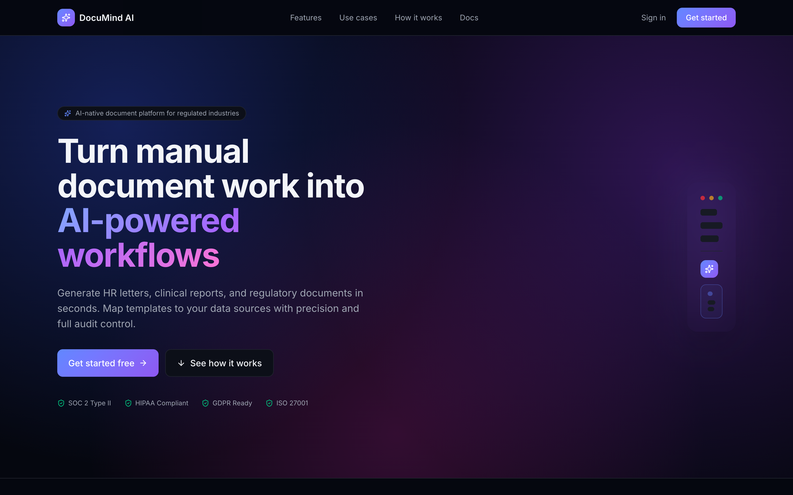
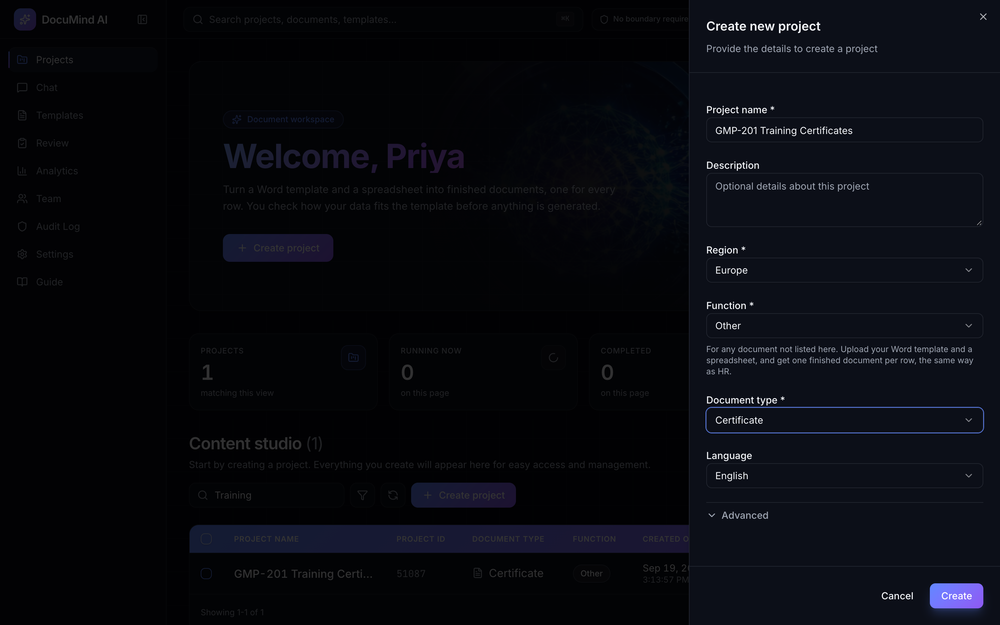
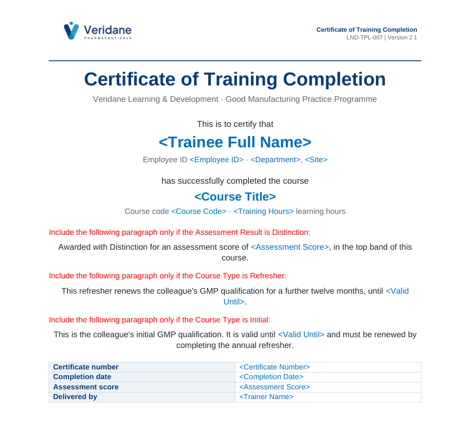
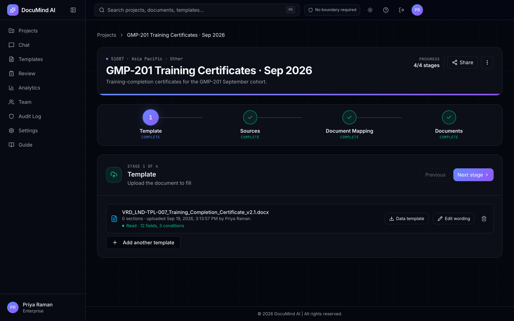
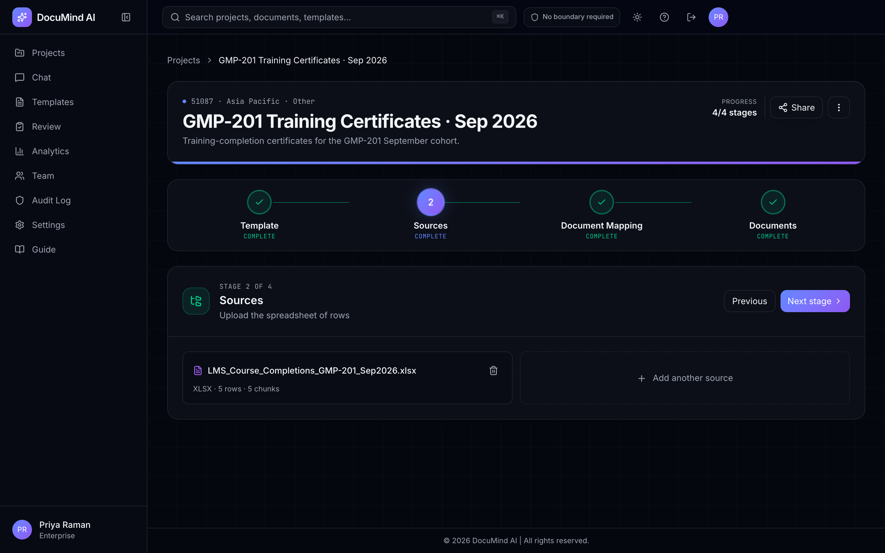
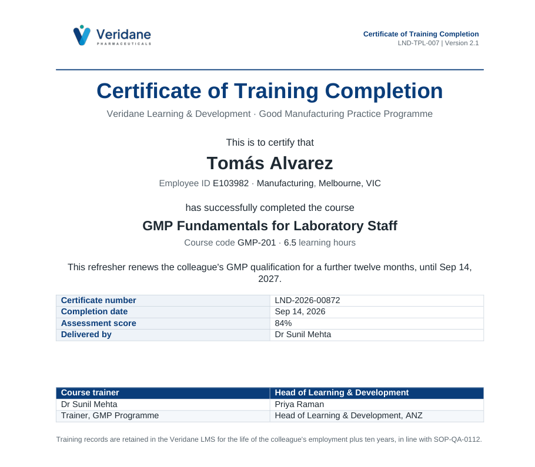

# DocuMind AI

### Your Word template + your spreadsheet → one finished, approved document for every row.

**Offer letters. Certificates. Notices. Agreements. Any document your team fills in by hand.**

---

## The problem

Every week someone opens a Word template and copies names, dates and figures from a spreadsheet into it. They delete the clauses that don't apply, remove the notes the author left, and save it under a new name. They do this again for the next person, and the next.

It's slow, it's easy to get wrong, and a mistake in an offer letter or a certificate is expensive.

## What DocuMind does

You upload the template you already use and the spreadsheet you already have. DocuMind returns one finished document per row:

- **Your layout stays exactly as it is.** Each document is made from a copy of your own file, so logo, letterhead, fonts, tables, footers and page numbers are identical to the master.
- **The right clauses for each person.** Paragraphs that apply only to some people ("only if Fixed Term", "only if Distinction") are kept or removed for each person.
- **Every value comes from your data.** Nothing is invented. If a value is missing, that document is held back for you to fix instead of going out with a gap.
- **Nothing leaves unapproved.** A document can't be downloaded until it's approved, reviewers can send it back with comments, and every action is recorded in the audit log.

---

## See it in action: 5 training certificates in minutes

This demo uses a fictional pharmaceutical company, Veridane. Its Learning & Development team issues a GMP training certificate to everyone who completes a course.

### 1. Start a project, for HR or for any document

Human Resources has ready-made document types. **Other** covers everything else: certificates, notices, agreements, forms and reports. Both work the same way.

  
  

### 2. Upload the template you already use

This is Veridane's own certificate master. The blue text shows what changes for each person. The red lines are the author's notes, saying which paragraph applies to whom.

DocuMind reads the template once and lists everything it needs: here, **12 values and 3 optional paragraphs**. You can keep working while it reads.

### 3. Add your spreadsheet

The spreadsheet is a plain export from the learning system, with its own column names. It doesn't need renaming or reformatting.

### 4. Match columns with a click

Each value in the template is paired with a column, and the first row is shown so you can see it's right. Pairings your organisation has confirmed before are suggested for you again next time.

### 5. Generate, review, approve, download

One document per row, each waiting for approval. Download them as DOCX or PDF, one at a time or all at once.

### The result

Each certificate has that person's details and only the paragraphs that apply to them.

| Eleanor: initial course, **Distinction** | Tomás: **refresher**, Pass |
|---|---|
|  |  |

Eleanor's certificate keeps the Distinction paragraph and the initial-qualification wording. Tomás's has neither; it gets the refresher paragraph instead. No one edited either certificate by hand.

---

## Built for teams that can't afford a wrong document

| | |
|---|---|
| **Layout preserved** | Each document is made from a copy of your own template. Nothing is rebuilt. |
| **Only the right clauses** | Optional sections are decided for each person from their row. |
| **Values come from your data** | Every name, date and figure comes from a cell in your spreadsheet. |
| **Review built in** | Reviewers comment and request changes, and authors can't close a review of their own document. |
| **Approved before download** | Unapproved documents can't leave the system. |
| **Full audit trail** | Every upload, approval and download is recorded with who did it and when. |
| **Local formats** | Dates, currency and numbers are formatted for the project's locale. |
| **Works in the background** | Reading a template runs in the background, and a tray tells you when it's done. |

## Who it's for

- **HR and People teams:** offer letters, promotion memos, termination letters, policy notices.
- **Learning & Development:** training and completion certificates.
- **Operations and Legal:** agreements, notices, standard letters.
- **Anyone** who fills in the same Word document again and again from a list.

---

### Stop copying and pasting. Start approving.

---

Every screenshot is from the running application. Veridane Pharmaceuticals, its people and its data are fictional and exist only for this demo.
