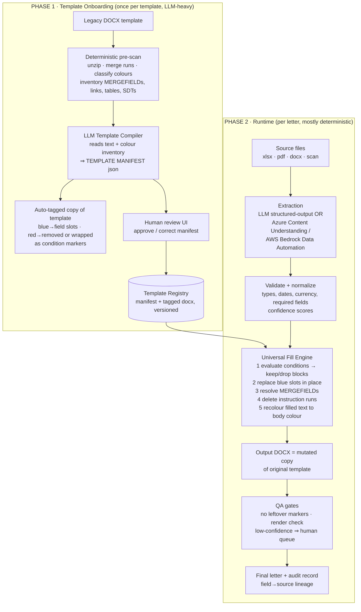

# Automating Template-Based Document Generation with LLMs
## Research Report: Processing DOCX Templates at Industrial Scale (Lakhs of Templates, Zero Per-Template Code)

**Version 1.0 · 2026-07-24 · Companion to `BACKEND_SPEC.md`**
Grounded in a real analysis of the uploaded template `Template_InputFIle.docx` (Hospira Australia / Pfizer HR offer letter).

---

## 0. Executive Summary — direct answers first

| Your question | Short answer |
|---|---|
| Blue text = exact mapping from source? | Yes — handle **deterministically**, not with free LLM writing. LLM extracts values from the source once (structured JSON); a generic engine swaps the text inside the blue runs in place. Style survives automatically because only the text node changes. |
| Red text = LLM instructions? | Yes — red runs are **instructions written for the human processor**. The system "compiles" them once per template into machine rules: value-formatting rules (`Put current date in DD/MM/YYYY`), source-mapping hints (`Put colleague first and last name from source file`), and **conditional include/exclude logic** (`Include the following section only if Colleague Type is Fixed Term`). At runtime the engine evaluates them; the red instruction text itself is deleted from the final letter. |
| Black text + links preserved? | Guaranteed **by construction**: the engine only ever touches runs classified as fillable (blue/red/mergefield). Everything else — legal paragraphs, letterhead, tables, headers/footers, the `FUSE` hyperlink, page-number fields — is never rewritten, so fonts, styles and layout cannot drift. |
| Is RAG needed? | **Not for this template class.** Your template needs zero retrieval: it is field-fill + conditional assembly. RAG becomes useful only when a *generative* section must be written from **large** source corpora (see §6 decision table). |
| Is vectorization needed? | **Not for filling.** Embeddings have three *optional* supporting uses: fuzzy field-name matching (source label ↔ template field), retrieval when sources are huge, and clustering/deduplicating lakhs of templates during onboarding. |
| Other file formats (PDF etc.) as source? | Yes — extraction layer normalizes any source (PDF/XLSX/DOCX/scans) into one JSON record; cloud services (Azure Content Understanding, AWS Bedrock Data Automation) do exactly this step as managed services. |
| Azure / AWS services? | They cover the **source-extraction** side and the **LLM** side very well; **no hyperscaler service fills a Word template for you** — that last mile is either your own small universal engine (recommended) or a commercial doc-gen API (Adobe Document Generation, Docmosis, Aspose). Full mapping in §8. |
| "I don't want Python scripts per template" | Correct instinct. The scalable design is **one universal engine + one machine-generated "Template Manifest" (JSON) per template**. Code count stays at 1 forever; templates are onboarded as *data*, not code. §4.2 and §9. |
| Is it possible to keep exact order & layout? | Yes — proven pattern. The output is always a mutated **copy of the original file**; order/layout are inherited, not reconstructed. §5 gives the full flow for your template. |

---

## 1. Problem Statement

### 1.1 The manual process being replaced

An operations colleague opens a Word template, reads coloured guidance embedded by the template author, and produces a finished letter by hand:

1. Types today's date in the required format.
2. Copies exact values (name, position, salary, dates, grade…) from a source file (HR system export, spreadsheet, PDF) into the placeholders.
3. Reads conditional instructions ("include this section only if the Colleague Type is Part Time") and **deletes the sections that don't apply**, keeping the ones that do.
4. Deletes the instruction sentences themselves.
5. Leaves every other word, table, logo, footer and hyperlink untouched.
6. Saves/prints the letter.

This is repeated across **lakhs of distinct templates** industry-wide. Each template encodes its own fields and rules — but always *informally*, in colour and prose, for a human reader. That informality is the entire automation problem.

### 1.2 Ground truth: what is actually inside the uploaded template

The file was unpacked (a `.docx` is a ZIP of XML), fragmented runs merged, and every text run classified by its `w:color`. Findings:

| Signal | Count / chars | Meaning in this template | Automation treatment |
|---|---|---|---|
| **Blue runs** (`0000FF`) | 27 runs · 648 chars | Exact-value placeholders: `<Colleague First Name>`, `<Position Title>`, `<Reporting To>`, `<Location>`, `<Effective Date>`, `<Original Start Date>`, `<Scheduled Weekly Hours>`, `<Grade>`, `<GBS…Services>`, `<Country PX…Email>` | Deterministic replace from extracted data |
| **Blue mail-merge fields** (`«…»` MERGEFIELD codes) | 7 distinct: `LAB__FT_SALARY__38_HR_`, `LAB__FT_TP_38_HR`, `LAB_FT_Super_38_HR_`, `Grade_EBA`, `LAB__PT_SALARY__38_HR_`, `LAB__PT_TP_38_HR`, `LAB_PT_Super_38_HR_` | Legacy Word merge fields for salary/super/total package (FT & PT variants), incl. inside two tables | Resolve field code → literal value (currency-formatted) |
| **Red runs** (`FF0000`) | 30 runs · 1,381 chars | Human instructions, three species: ① formatting (`Put Current date of the System in DD/MM/YYYY Format` + `<Date DD/MM/YYYY>`), ② mapping hints (`Put the signatory and signatory title from the source file`, `<Signatory>`, `<Signatory Title>`), ③ **conditional block markers** (`Include the following text only if the Colleague Type is Full time / Part time / Fixed Term`) — one conditional even carries its own red body (`Dates of Effect … <Start Date> … <End Date>`) | Compile to rules once; at runtime compute/evaluate; **delete the instruction text** from output |
| **Black / inherited** | ~13,000 chars | Legal clauses, letterhead, Enterprise Agreement text, both remuneration tables' labels | Never touched |
| **Hyperlink** | `FUSE` (red-styled link) + contact-matrix references | Must survive intact (relationship + style) | Never touched (link kept even where surrounding red guidance is removed — rule set per template) |
| **Headers/footers** | Letterhead header, `Page X of Y` field footer | Live Word fields | Never touched |
| **Content controls (SDT)** | 0 | Template predates structured tagging | Colour convention is the only machine signal — typical of legacy estates |

Two implications worth stating plainly. First, **this template needs no creative writing at all** — every output character is either static, an exact value, or a kept/dropped block. Second, the red text is effectively a **program written in English for a human interpreter**; automation means compiling that program once and executing it forever.

### 1.3 Why "a script per template" cannot scale — and what can

A hand-written script hard-codes one template's placeholders and conditions; with lakhs of templates that is lakhs of scripts, each breaking when its template gets edited. The scalable inversion: keep **one** template-agnostic engine, and turn each template into **data** — a machine-readable *manifest* produced automatically by an LLM reading the template the same way the human processor does. New template = new manifest (minutes, mostly automatic), never new code.

### 1.4 Requirements derived

R1 Pixel-faithful layout: output is the template file, filled — same styles, fonts, tables, headers/footers, numbering, links.
R2 Zero per-template code; onboarding a template is an automated + reviewable data step.
R3 Blue = deterministic fill; Red = compiled instructions (format / map / conditional include); Black+links = untouchable.
R4 Any source format (DOCX/PDF/XLSX/CSV/scans) normalized to one data record.
R5 Full traceability: which source value filled which field, which condition kept/dropped which block, confidence per field.
R6 Human-in-the-loop where confidence is low; straight-through processing where it is high.
R7 Works for the adjacent template classes too (narrative sections, multi-record tables) without redesign.

---

## 2. The Core Insight

> **A coloured template is a program written in natural language for a human CPU. Don't run an LLM on every letter — use the LLM once as a *compiler*, then run the compiled program deterministically forever.**

Splitting the problem this way changes everything about cost, accuracy and scale:

| | LLM-per-letter (naïve) | Compile-once, execute-many (recommended) |
|---|---|---|
| Layout fidelity | LLM rewrites document → drift risk | Engine mutates original file → guaranteed |
| Cost per letter | Full-document LLM tokens every time | Tiny: one extraction call on the *source*, zero LLM on the template path |
| Determinism / audit | Non-deterministic prose | Same inputs ⇒ byte-identical output |
| Hallucination surface | Whole letter | Only extracted field values (validated, confidence-scored) |
| Template edits | Silent behavior change | Re-compile → diff of manifest → review |

---

## 3. Solution Landscape A — Traditional approaches (know them, reuse their ideas)

| Approach | How it works | Strengths | Why it fails the "lakhs of legacy templates" goal |
|---|---|---|---|
| **Word Mail Merge** (your template already contains `«MERGEFIELD»`s!) | Field codes bound to a data source; Word merges | Native, styles safe | Fields must be authored per template; no rich conditions; data must already be structured; humans still drive Word |
| **Content Controls + Power Automate** ("Populate a Microsoft Word template" action) | Author adds SDT controls; flow injects values | No-code, M365-native | Requires re-authoring every template with controls; plain value fill only — no conditional block removal logic like yours |
| **Tag engines** — `docxtpl` (Jinja2 in Word), **Adobe Document Generation API** (Word template + JSON → DOCX/PDF; supports text tags, tables, images and conditional sections, with a Word "Tagger" add-in), Docmosis, Aspose.Words LINQ, Windward/Conga | Template carries `{{tags}}` / ``; engine merges JSON | Deterministic, fast, battle-tested; conditional sections supported; layout-safe | The show-stopper is **authoring**: every legacy template must first be converted into the tag syntax. Manually re-tagging lakhs of templates is the same human bottleneck you're removing |
| **RPA** (UiPath, Power Automate Desktop) | Robot mimics the human in Word | No template change | Brittle, slow, per-template flows = per-template scripts in disguise |
| **Custom script per template** | Python/VBA hard-coding | Total control | Explicitly what you (rightly) reject |

**The reusable idea:** tag engines are *excellent executors* — their only flaw is manual tagging. So let the LLM do the tagging. That is exactly Phase 1 below: legacy coloured template → auto-converted into a tagged template + manifest → executed by one deterministic engine (yours, or even Adobe's) for life.

---

## 4. Solution Landscape B — Recommended architecture: **Template Compiler + Universal Fill Engine**



### 4.1 Phase 1 — the Template Manifest (what the LLM compiles the colours into)

One JSON document per template version; below is the actual shape for *your* file (abridged):

```json
{
  "template_id": "hospira_au_offer_letter",
  "version": 3,
  "fields": [
    {"id": "colleague_first_name", "type": "string", "required": true,
     "slots": [{"kind": "blue_placeholder", "text": "<Colleague First Name>", "occurrences": 3}],
     "source_hint": "Colleague first name from source file"},
    {"id": "current_date", "type": "date", "format": "DD/MM/YYYY",
     "slots": [{"kind": "red_placeholder", "text": "<Date DD/MM/YYYY>"}],
     "value_rule": "system.today",
     "compiled_from": "Put Current date of the System in DD/MM/YYYY Format"},
    {"id": "position_title", "type": "string", "required": true,
     "slots": [{"kind": "blue_placeholder", "text": "<Position Title>", "occurrences": 2}]},
    {"id": "ft_salary", "type": "currency", "currency": "AUD",
     "slots": [{"kind": "mergefield", "code": "LAB__FT_SALARY__38_HR_", "occurrences": 3}]},
    {"id": "signatory", "type": "string",
     "slots": [{"kind": "red_placeholder", "text": "<Signatory>"}],
     "compiled_from": "Put the signatory and signatory title from the source file"}
  ],
  "conditions": [
    {"id": "cond_fulltime",
     "expression": "colleague_type == 'Full time'",
     "keeps_blocks": ["blk_offer_ft", "blk_hours_ft", "blk_remuneration_ft"],
     "compiled_from": "Include the following text only if the Colleague Type is Full time:"},
    {"id": "cond_parttime",
     "expression": "colleague_type == 'Part time'",
     "keeps_blocks": ["blk_offer_pt", "blk_hours_pt", "blk_remuneration_pt"]},
    {"id": "cond_fixedterm",
     "expression": "colleague_type == 'Fixed Term'",
     "keeps_blocks": ["blk_dates_of_effect"],
     "compiled_from": "Include the following section till end date only if the Colleague Type is Fixed Term:"}
  ],
  "blocks": [
    {"id": "blk_dates_of_effect", "anchor": {"start_el": 41, "end_el": 44},
     "contains_fields": ["start_date", "end_date"]}
  ],
  "delete_always": ["every red instruction run id …"],
  "post_fill": {"recolour_filled_to": "auto-body", "refresh_fields": true},
  "protected": "all other elements incl. hyperlink 'FUSE', headers, footers, tables"
}
```

Key design points:

1. **The pre-scan is deterministic** (colour classification, MERGEFIELD inventory, element indexing) — the LLM never guesses what is blue; it *interprets* what the blue/red text *means*: canonical field names, data types, date/currency formats, condition expressions, and exact block boundaries for each "Include only if…".
2. **Block boundary resolution is the one genuinely hard sub-problem** ("the following section" — until where?). The compiler LLM proposes boundaries using heading structure + the instruction's wording ("till end date", "text" vs "section"); the human reviewer confirms with a visual highlight UI. This review takes ~1–3 minutes per template and is the only human step in onboarding.
3. **Canonical field vocabulary.** The compiler maps label variants to one schema (`Colleague First Name` = `First Name` = `Emp. FName` → `colleague_first_name`). Embedding similarity against a growing org-wide field dictionary makes this consistent across lakhs of templates — vectorization use #1.
4. **Manifest is versioned & diffable.** Template edited ⇒ recompile ⇒ reviewer sees "field added: `<Probation Period>`; condition changed" — governance for free.
5. Optionally the compiler also **emits a tagged twin** of the template (blue runs → `{{colleague_first_name}}`, conditional blocks wrapped in ``) so a commodity tag engine — docxtpl or Adobe Document Generation API — can execute it. Same architecture, choice of executor.

### 4.2 Phase 2 — the Universal Fill Engine (runtime, per letter)

Deterministic OOXML surgery on a **copy** of the template blob, driven only by the manifest:

1. **Evaluate conditions** against the validated source record (pure expression evaluation; an LLM is consulted only if a manifest marks a condition `fuzzy`, e.g. "if the role is managerial"). Dropped blocks: delete elements `start_el…end_el`. Kept blocks: delete just the red instruction line, recolour any red body text (your *Dates of Effect* block) to the body colour.
2. **Fill blue slots**: locate each slot's runs, replace the text node only — `rPr` (font, size, bold) is untouched, so styling is inherited; then recolour blue→body colour per `post_fill` policy (matches what the human did when typing the value).
3. **Resolve MERGEFIELDs**: replace the `fldChar/instrText` complex with a literal run carrying the field's formatting; currency/number formatting from the manifest (`$72,000.00`).
4. **Delete `delete_always` runs** (all remaining instruction text).
5. Never enumerate or rewrite anything else — black text, tables, images, headers/footers, the `FUSE` hyperlink relationship all persist untouched (R1/R3 by construction).
6. **QA gates**: assert zero leftover `<…>` / `«…»` / red runs; assert exactly one of each mutually-exclusive block family survived; headless render (LibreOffice → PDF) + optional vision-model glance for gross layout faults; required-field misses or low-confidence extractions route the letter to a human review queue instead of shipping.
7. Emit the **audit record**: per field → source file/cell/page, extracted value, confidence; per condition → inputs and verdict. (Plugs into `BACKEND_SPEC.md` §13.7.)

### 4.3 Where the LLM actually runs at runtime — and where it must not

| Runtime step | LLM? | Why |
|---|---|---|
| Source-value extraction (unstructured sources) | ✅ structured-output call (or managed service) | Turning a PDF/scan into `{colleague_type:"Part time", base_salary:…}` is exactly what LLM/IDP is for |
| Condition evaluation | ❌ (✅ only for `fuzzy` conditions) | `colleague_type == 'Fixed Term'` must be deterministic and auditable |
| Placing values into the DOCX | ❌ never | Layout fidelity demands surgery, not generation |
| Narrative sections (other template classes) | ✅ grounded generation, per `BACKEND_SPEC.md` §9 | Only where a template genuinely asks for prose |
| QA visual check | optional ✅ vision | Cheap safety net |

---

## 5. End-to-End Flow for *your* template (concrete walkthrough)

**Onboarding (once):** upload `Template_InputFIle.docx` → pre-scan finds 27 blue runs, 30 red runs, 7 MERGEFIELDs, 1 hyperlink, 0 SDTs → compiler LLM emits the manifest of §4.1 (≈ 18 fields, 3 condition families, 6 conditional blocks, 30 deletions) → reviewer confirms block boundaries (the *Fixed Term* block correctly ends after the `<End Date>` sentence, per "till end date") → manifest v1 stored. Template is now live.

**Runtime (every letter):**

1. HR uploads the source (say `NewHires_July.xlsx` or a Workday PDF) and picks the template (or a classifier picks it).
2. Extraction produces one validated record per colleague: `{colleague_first_name:"Priya", colleague_last_name:"Sharma", colleague_type:"Part time", position_title:"QC Analyst", reporting_to:"QC Manager", location:"Mulgrave", scheduled_weekly_hours:22.8, grade_eba:"Level 4", pt_salary:48350.00, pt_super:5560.25, pt_total:53910.25, effective_date:"2026-08-03", original_start_date:"2021-02-15", signatory:"J. Chen", signatory_title:"PX Lead ANZ"}` with per-field confidence.
3. Engine: `current_date := 24/07/2026`; conditions ⇒ keep all *Part time* blocks, delete *Full time* offer/hours/remuneration blocks and the *Fixed Term* block; fill blues; resolve the three PT MERGEFIELDs inside the remuneration table (`$48,350.00` …); delete every red instruction; recolour filled values to black.
4. QA passes (no leftover markers, PT table present, FT table gone, `FUSE` link intact) → `Offer_PriyaSharma_51255_en.docx` + audit lineage. Elapsed: seconds; LLM cost: one small extraction call.

**Batch mode:** one XLSX with 500 rows ⇒ 500 letters from one extraction pass — the engine loop is pure CPU.

---

## 6. RAG & Vectorization — a decision framework (direct answer to "is it needed?")

**RAG = retrieve relevant chunks of big sources at generation time. It exists to solve *context overflow*, nothing else.** Your workload's questions are answered by data extraction, not retrieval.

| Situation | Approach | RAG? | Embeddings? |
|---|---|---|---|
| Field-fill template (yours), structured source (XLSX/CSV/HRIS API) | Direct key mapping + validation | ❌ | Optional: fuzzy header↔field matching |
| Field-fill template, unstructured source ≤ ~50–100 pages | One structured-output extraction call with the whole source in context | ❌ | ❌ |
| Field-fill, source is a *huge* corpus (1,000-page policy pack; value could be anywhere) | Embed source chunks; retrieve per field; extract from top hits | ✅ targeted | ✅ |
| Template has **narrative sections** ("summarize the investigation…") with small sources | Grounded generation, full source in context | ❌ | ❌ |
| Narrative sections with large/many sources | Full RAG per section (`BACKEND_SPEC.md` §8–9) | ✅ | ✅ |
| Onboarding lakhs of templates | Cluster near-duplicate templates; reuse manifests; canonical field dictionary | ❌ | ✅ (dedup + field matching) |

Rules of thumb: **templates are never chunked or vectorized**; embeddings enter only as (1) field-name matcher, (2) big-source retriever, (3) template dedup/cluster index. For the offer-letter class, ship v1 with **no vector database at all** — add one when a template class or source size demands it. This keeps the first release dramatically simpler.

---

## 7. Sources beyond DOCX (PDF, scans, spreadsheets)

The engine never cares what the source was — extraction normalizes everything to the manifest's field schema:

- **XLSX/CSV** → header-mapped records (embedding-assisted matching for messy headers); zero LLM if headers match.
- **Digital PDF / DOCX** → text+layout extraction, then one LLM structured-output call against the manifest schema ("return JSON: {colleague_type: 'Full time'|'Part time'|'Fixed Term', base_salary: number, …}; null when absent — never guess").
- **Scanned PDF / images** → OCR+layout first (Tesseract self-host, or the managed services below), then the same call.
- **APIs (Workday/SAP)** → direct records; the manifest's `source_hint`s make mapping self-documenting.
Confidence scores + `required` flags decide straight-through vs human-check per letter (R6).

---

## 8. Azure & AWS service mapping

**The honest headline:** both clouds are strong for *reading sources* and *hosting LLMs*; **neither offers a managed "fill this Word template" service** — the fill engine (small, ~1–2k lines, format-agnostic) is yours, or you delegate execution to a commercial doc-gen API using the auto-tagged twin from Phase 1.

### 8.1 Azure

| Pipeline role | Azure service | Notes |
|---|---|---|
| Source extraction (structured/forms, deterministic) | **Azure Document Intelligence** (now part of **Azure Content Understanding**, Microsoft Foundry Tools) | High-accuracy extraction for fixed layouts; custom models for proprietary layouts |
| Source extraction (unstructured, schema-based, LLM-powered) | **Azure Content Understanding** analyzers | Define your field schema in natural language; returns JSON with confidence + grounding; custom analyzers improve with a few labeled examples; multimodal (docs/images/audio/video) |
| Template-compiler & extraction LLM | **Azure OpenAI / Microsoft Foundry models** (or Anthropic Claude via API) | Structured outputs for manifest + record extraction |
| Retrieval (only if a RAG case appears) | **Azure AI Search** (hybrid + integrated vectorization) | Plugs into Content Understanding outputs |
| Orchestration / queues / compute | Functions or Container Apps + Service Bus + Durable Functions/Logic Apps | Fill engine runs as a container |
| Storage / registry / audit | Blob Storage, Azure SQL/PostgreSQL, Cosmos DB | Template registry + lineage |
| Human review UI hosting & SSO | App Service + Entra ID | Reviewer queue |

### 8.2 AWS

| Pipeline role | AWS service | Notes |
|---|---|---|
| Source extraction (managed IDP) | **Amazon Bedrock Data Automation (BDA)** | **Blueprints** = your manifest's field list with natural-language instructions per field; auto classification/splitting, key/value normalization, confidence scores + bounding boxes, hallucination mitigation; blueprint *instruction optimization* tunes accuracy from ~10 labeled examples; documents up to 3,000 pages; embedded-hyperlink extraction |
| OCR/forms primitive (lower-level alternative) | Amazon Textract | When you want raw building blocks instead of BDA |
| LLMs (compiler, extraction, any narrative class) | **Amazon Bedrock** (Anthropic Claude models) | Structured outputs; Bedrock Knowledge Bases if/when RAG is needed |
| Human-in-the-loop review | **Amazon A2I** or custom queue UI | Confidence-routed review |
| Orchestration / queues / compute | Step Functions + SQS + Lambda/ECS | Fill engine as ECS/Fargate container |
| Storage / registry / audit | S3, Aurora PostgreSQL/DynamoDB | Versioned manifests + lineage |

### 8.3 Commercial "last-mile" executors (optional, instead of your own engine)

**Adobe Document Generation API** — Word template + JSON → high-fidelity DOCX/PDF; supports text tags, dynamic tables/images, **conditional sections**, and a Word "Tagger" add-in; your Phase-1 compiler can emit its tag syntax directly, making Adobe the executor while you keep the intelligence. Similar: Docmosis, Windward, Conga, Aspose.Words (SDK, self-host — enterprise favourite when data cannot leave your VPC). Trade-off: per-document fees and less control over exotic OOXML (your MERGEFIELD chevrons would be converted to tags at compile time anyway).

---

## 9. Scaling to lakhs of templates — the Onboarding Factory

1. **Bulk intake:** crawl the template estate → pre-scan all files → **cluster by structural fingerprint + embedding similarity**; industry estates typically collapse 60–80% into families that differ only in letterhead/values ⇒ one manifest per family, not per file.
2. **Auto-compile** every cluster representative; compiler self-reports confidence per manifest item (field naming, block boundaries).
3. **Review by exception:** high-confidence manifests auto-approve; ambiguous ones enter the reviewer queue (visual diff/highlight UI, minutes each). Reviewer corrections are stored and **fed back as few-shot examples** — the compiler measurably improves as the estate is processed.
4. **Shadow-run** each new manifest: generate against historical source data, diff against historically hand-made letters where available; promote to production on match.
5. **Governance:** manifests versioned, diffable, owner-approved; drift alarms when a template file changes without recompile; dashboards for straight-through rate, field-level accuracy, human-touch rate, cost/letter.
6. **Convention uplift (cheap win):** publish a 1-page authoring standard for *new* templates (consistent colours, or better: content controls / `{{tags}}`). New templates then compile at ~100% confidence; the LLM compiler remains for the legacy long tail.

---

## 10. Futuristic directions (12–24 months)

1. **Agentic template modernization:** an agent converts each legacy template into a canonical tagged twin + manifest, *renders sample outputs*, visually compares against human-made historical letters, and iterates until pixel-parity — onboarding entirely by agent, humans only sign off.
2. **Vision-loop QA as standard:** every generated letter rendered to images and glanced at by a multimodal model ("any overlapping text, broken tables, leftover red?") — near-zero-cost final gate.
3. **Self-learning mapping memory:** every human correction (field mapping, block boundary, formatting) embedded and recalled for similar future templates — case-based reasoning that compounds across the estate.
4. **Computer-use agents driving Word itself:** viable for one-off exotic formats; for lakhs-scale it stays a fallback — slower, costlier and less deterministic than compiled manifests.
5. **Straight-through "dark processing"** with statistical QC sampling once field-accuracy metrics stabilize above threshold — the human moves from *maker* to *auditor of samples*.
6. **Cross-format generalization:** the manifest abstraction extends naturally to PDF AcroForms, XLSX report shells and PPTX shells — same compiler idea, different executor per format.

---

## 11. Risks & mitigations

| Risk | Mitigation |
|---|---|
| Colour convention inconsistently applied in legacy files (black "Include only if…" lines exist in the wild) | Compiler classifies by **text pattern + colour**, not colour alone; low-confidence → reviewer |
| Wrong conditional block boundaries | Reviewer highlight UI at compile time; runtime assertion that exactly one variant of each block family survived |
| Extraction hallucination (salary!) | Structured outputs with `null`-when-absent; type/range validators; confidence thresholds; required-field hard stops; per-field lineage |
| Fragmented runs split placeholders across XML runs | Run-merge normalization in pre-scan (already applied in this analysis: 85 runs merged) |
| Template edited after onboarding | Blob hash pinning; drift alarm; recompile + manifest diff review |
| PII in HR sources | Regional processing, encryption, provider no-training guarantees, redaction option, retention policy (see BACKEND_SPEC §13.9) |
| Vendor lock-in on extraction | Extraction behind one interface; BDA/Content Understanding/self-host LLM interchangeable |

---

## 12. Recommendation & build path

1. **Adopt the two-phase architecture**: LLM Template Compiler (+ human review by exception) → versioned Template Manifests → one deterministic Universal Fill Engine. No per-template code, ever (R2).
2. **Ship v1 without any vector DB or RAG** — this template class doesn't need them; add retrieval only when a large-corpus or narrative class arrives (§6). Vectors return first as the field-name dictionary and template-dedup index during bulk onboarding.
3. **Source extraction:** start with direct LLM structured-output extraction; adopt **Azure Content Understanding** or **AWS Bedrock Data Automation** when you want managed confidence scoring, classification and OCR at volume — they slot behind the same interface.
4. **Keep the fill engine in-house** (small, generic, OOXML-surgical) for full fidelity incl. MERGEFIELDs and hyperlinks; optionally emit tagged twins so Adobe Document Generation/Docmosis can execute specific estates.
5. **Sequence:** (a) manifest schema + compiler prompt on 10 diverse real templates → (b) fill engine + QA gates → (c) reviewer UI → (d) bulk onboarding factory with clustering → (e) managed-IDP integration + dashboards. Steps (a)–(b) are ~2–3 weeks to a convincing pilot on this very offer letter.
6. This report layers onto `BACKEND_SPEC.md`: manifests live in the template registry (§5), the compiler is a `parse`-queue worker (§7), the fill engine extends the assembler (§10), extraction joins ingestion (§8), and confidence-routing joins review (§12).

**Bottom line:** what your template author encoded in blue, red and black is already a machine-executable specification — it just needs one compiler to read it the way the human did, once. After that, generating a perfect letter is deterministic, auditable, near-free — and identical in effort whether you have one template or ten lakh.

---

### References
Azure Content Understanding & Document Intelligence (Microsoft Foundry Tools): learn.microsoft.com/azure/ai-services/content-understanding/ · contentunderstanding.ai.azure.com
Amazon Bedrock Data Automation (blueprints, confidence, optimization): docs.aws.amazon.com/bedrock/latest/userguide/bda.html · aws.amazon.com/blogs/machine-learning/scalable-intelligent-document-processing-using-amazon-bedrock-data-automation/
Adobe Document Generation API (Word template + JSON → DOCX/PDF, conditional sections, Tagger add-in): developer.adobe.com/document-services/apis/doc-generation/
Companion document: `BACKEND_SPEC.md` (platform architecture, data model, APIs, RAG engine for narrative template classes).

— End of report —
